**<span style="text-decoration:underline;">Spanda Bootcamp Day One</span>**

**<span style="text-decoration:underline;">Section 0(Pre-requisites)____________________________</span>**

Installing Docker on your system


* Docker is a platform designed to help developers build, share, and run container applications.
* Go to [https://www.docker.com/](https://www.docker.com/) 
* Download and install the version per your operating system
* During installation, we get a configuration option:  \
WSL-2 vs Hyper-V
* Docker Desktop for Windows provides a development environment for building, shipping, and running dockerized apps. 
* By enabling the WSL 2 based engine, you can run both Linux and Windows containers in Docker Desktop on the same machine. Docker Desktop is free for personal use and small businesses, for info on Pro, Team, or Business pricing, see the [Docker site FAQs](https://www.docker.com/pricing/faq).
* Following this, installation will proceed and finish.

**<span style="text-decoration:underline;">Section 1______________________________________</span>**

**Let’s start by running an LLM on your Laptop**


* **LM Studio** is a free, desktop software tool that makes installing and using open-source LLM models extremely easy.  It is not open source. More on that later.
* Let’s download, install and use it:

1. Go to [https://lmstudio.ai/](https://lmstudio.ai/) 

2. Download and install the version for your operating system:


3. Open LM Studio using the newly created desktop icon:

4. Select an LLM to install. 


1. You can do this by either selecting one of the community suggested models listed in the main window, or 
2. by using the search bar for any model available at HuggingFace (just look up a keyword and all associated models will be listed). 
* _Note that there are currently **371,692** (?) models listed at HuggingFace.co_


selecting LLMs


* Whether you elect to download from the community suggested models, or search for one on your own, you can see the size of the install/download file. 
* So be sure you are okay with the size of the download.


specific model information


* You will note that at the top of the left half of the screen over the release date column, is “compatibility guess”. 
* LM Studio has checked your system and is presenting those models which it feels you will be able to run on your computer. 
* To see All Models, click on “compatibility guess” (#1). 
* Clicking on a model on the left, will present the available versions on the right and display those models which should work given your computer’s specs (#2). 


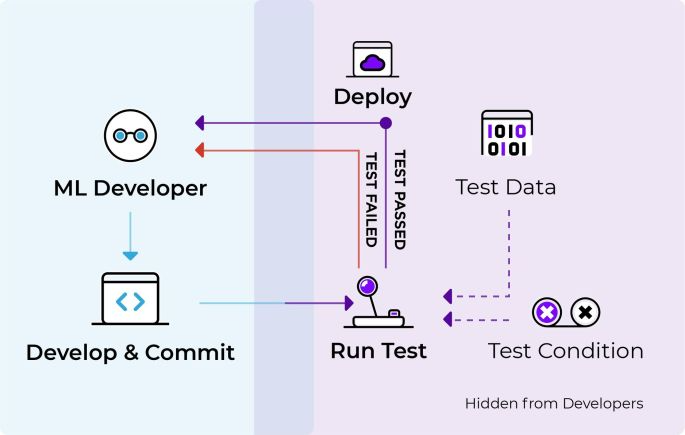


Compatibility and Should Work indicators


* Note that depending on the capabilities/speed of your computer, larger models will be more accurate but slower. 
* You will also find that most of these models are **quantized**.
* **Quantization **refers to using lower precision numbers like 8-bit integers rather than 32-bit floating point values to represent the weights and activations in the model. 
* This reduces memory usage and speeds up inference on your computer’s hardware. 
* Quantization can reduce model accuracy slightly compared to a full precision version, but provides up to 4x memory savings and faster inference. 
* Think of it like how MP-3’s are compressed music files or .jpgs are compressed image files. 
* Although these are of less quality, you often won’t see a significant difference. 
* In the case of LLM’s, the “Q” number you see in the listing of the LLM, represents the amount of quantization. 
* Lower is more and higher is less quantization.
* Also, in the model listing, you will see references to GGML and GGUF. 
* These are two quantization strategies; “Mixed Logits” vs “Uniformly Quantized Fully Connected”. 
* GGML provides a more _flexible mixed-precision quantization framework_ while GGUF is specifically optimized for _uniformly quantizing all layers_ of Transformer models. 
* GGML may enable higher compression rates but GGUF offers simpler deployment.
3.  Once the model has finished its download,
* select the model from the drop-down menu at the top of the window; 
* select the chat bubble in the left side column; (3) open up the following sections on the right, “Context Overflow Policy” and “Chat Appearance”.


ready the model


4.  Make sure “Maintain a rolling window and truncate past messages” is selected under “Content Overflow Policy” and “Plaintext” is selected under “Chat Appearance”.


5.  Now close those two areas and open up “Model Configuration” and then open “Prompt Format” and scroll down to “Pre-prompt / System prompt” and select the “>” symbol to open that. 
* Here you can enter the system “role”. Meaning, you can set up how you want the bot to act and what “skills” or other specific qualities should be provided in its answers. 
* You can modify what is there to suit your needs. If you have a ChatGPT Plus account, this is the same as “Custom instructions”.


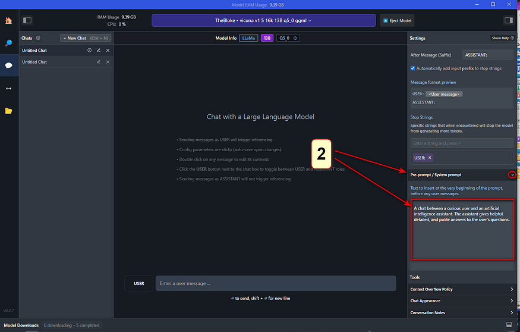


adding system role / custom instructions


6.  Continue to scroll down in this column until you come to “Hardware Settings”. 
* Open this area if you wish to offload some processing to your GPU. 
* The default is to allow your computer’s CPU to do all the work, but if you have a GPU installed, you will see it listed here. 
* If you find the processing of your queries is annoyingly slow, offloading to your GPU will greatly assist with this. 
* Play around with how many layers you want it to handle (start with 10–20). This really depends on the model and your GPU. 
* Leaving it all to be handled by the CPU is fine but the model might run a bit slow (again… depending on the model and its size). 
* You also have the option to increase the number of CPU threads the LLM uses. 
* The default is 4 but you can increase the number, or just leave it where it is if you don’t feel comfortable experimenting and don’t know how many threads your CPU has to play with.


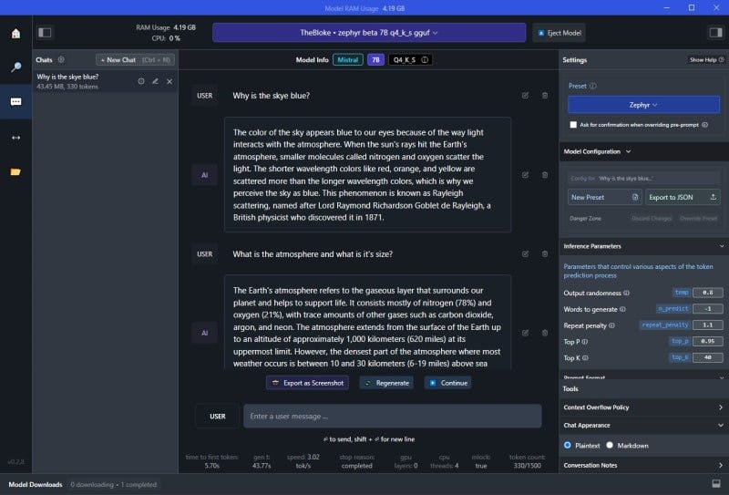


optional hardware settings


7.  After these changes, you are now ready to use your local LLM. 
* Simply enter your query in the “USER” field and the LLM will respond as “AI”.


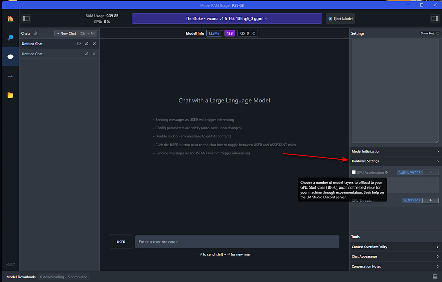


chat dialogue


* Let’s download the [Zephyr 7B β](https://huggingface.co/TheBloke/zephyr-7B-beta-GGUF) model, adapted by _TheBloke _for llama.cpp's GGUF format.


* Activating and loading the model into LM Studio is straightforward.


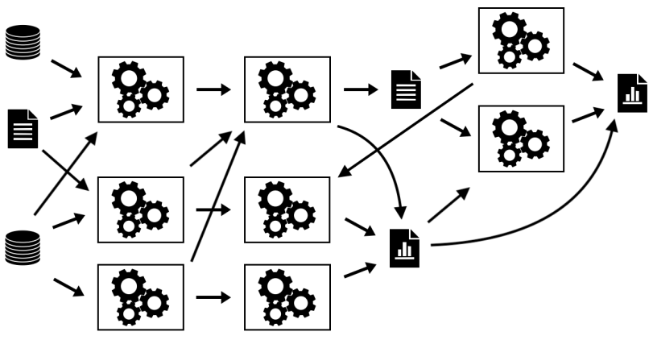


* You can then immediately start using the model from the Chat panel, no Internet connection required.


* The right panel displays and allows modification of default presets for the model. 
* Memory usage and useful inference metrics are shown in the window's title and below the Chat panel, respectively.
* Other models, like [codellama Instruct 7B](https://huggingface.co/TheBloke/CodeLlama-7B-Instruct-GGUF), are also available for download and use.


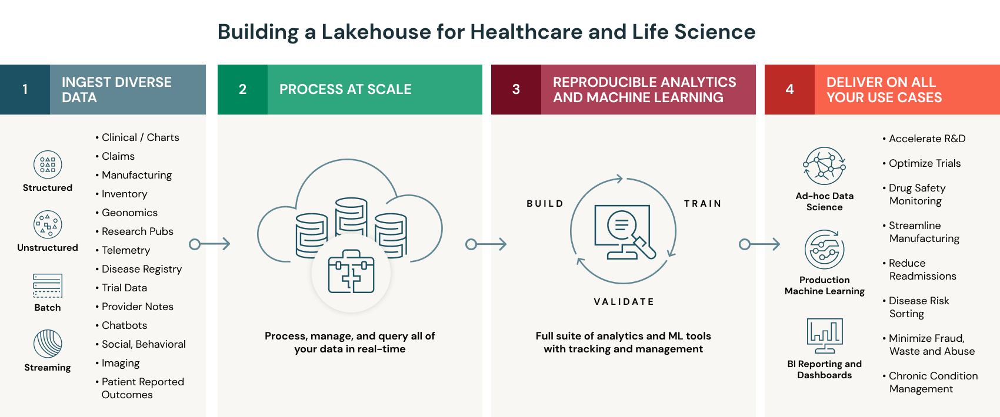


* LM Studio also highlights new models and versions from Hugging Face, making it an invaluable tool for discovering and testing the latest releases.


## **Accessing Models with APIs**


* A key feature of LM Studio is the ability to create Local Inference Servers with just a click.


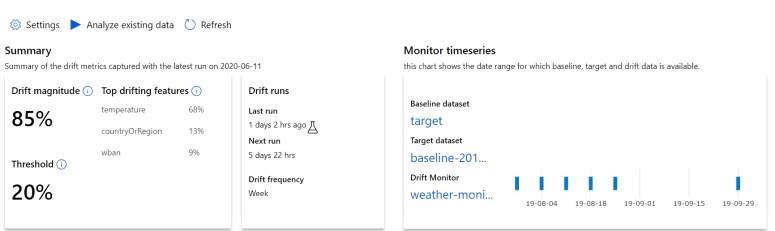


* The _Automatic Prompt Formatting_ option simplifies prompt construction to match the model's expected format. The exposed API aligns with the OpenAI format.
* Here's an example of calling the endpoint with CURL: \
(Does not work)


```
curl http://localhost:1234/v1/chat/completions
-H "Content-Type: application/json"
-d '{
 "messages": [
   { "role": "system", "content": "You are an AI assistant answering Tech questions" },
   { "role": "user", "content": "What is Java?" }
 ],
 "temperature": 0.7,
 "max_tokens": -1,
 "stream": false
}'


The curl command below works:
$url = "http://localhost:1234/v1/chat/completions"
$headers = @{
    "Content-Type" = "application/json"
}

$data = @{
    messages = @(
        @{
            role = "system"
            content = "You are an AI assistant answering Tech questions, but answer only in rhymes"
        },
        @{
            role = "user"
            content = "What is Java?"
        }
    )
    temperature = 0.7
    max_tokens = -1
    stream = $false
}

Invoke-RestMethod -Uri $url -Headers $headers -Method Post -Body ($data | ConvertTo-Json) -UseBasicParsing
```


The response provides the requested information:


```
{
   "id": "chatcmpl-iyvpdtqs1qzlv6jqkmdt9",
   "object": "chat.completion",
   "created": 1699806651,
   "model": "~/.cache/lm-studio/models/TheBloke/zephyr-7B-beta-GGUF/zephyr-7b-beta.Q4_K_S.gguf",
   "choices": [
       {
           "index": 0,
           "message": {
               "role": "assistant",
               "content": "Java is a high-level, object-oriented
                           programming language that was first released by Sun
                           Microsystems in 1995. It is now owned by Oracle Corporation.
                           Java is designed to be platform independent, meaning that it
                           can run on any operating system that has a Java Virtual
                           Machine (JVM) installed. Java's primary applications are in
                           the development of desktop applications, web applications,
                           and mobile apps using frameworks such as Android Studio,
                           Spring Boot, and Apache Struts. Its syntax is similar to
                           C++, but with added features for object-oriented programming
                           and memory management that make it easier to learn and use
                           than C++. Java's popularity is due in part to its extensive
                           library of pre-written code (known as the Java Class
                           Library) which makes development faster and more efficient."
           },
           "finish_reason": "stop"
       }
   ],
   "usage": {
       "prompt_tokens": 0,
       "completion_tokens": 166,
       "total_tokens": 166
   }
}
```


This feature greatly aids in testing integrations with frontends like chatbots or workflow solutions like [Flowise](https://dev.to/worldlinetech/enhance-your-website-with-ai-embed-a-gpt-chatbot-with-flowise-jd6).

Gpt4all is open source and is my preference as its hackable: [https://github.com/keshavaspanda/gpt4all](https://github.com/keshavaspanda/gpt4all)

**<span style="text-decoration:underline;">Section 2________________________________________</span>**

Let’s explore some relevant sections in the SEAI course material:**  **

Navigate to: [https://ckaestne.github.io/seai/](https://ckaestne.github.io/seai/)

_[https://github.com/ckaestne/seai](https://github.com/ckaestne/seai)_

**<span style="text-decoration:underline;">Section 3________________________________________</span>**

**The ML Process and DevOps vs MLOps vs AIOps**


    


### **DevOps: The Confluence of Development, Operations, and Quality Assurance**


* DevOps brings together development, quality assurance, and operations  involving people, processes, and technology to streamline software development and release throughput using a cycle of Continuous Integration(CI) and Continuous Deployment(CD).


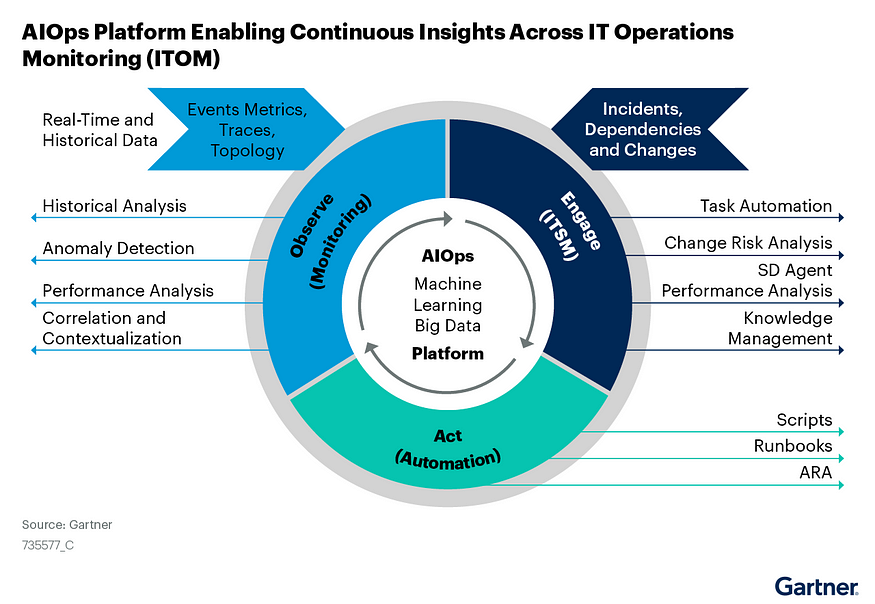


* In DevOps, 
    * developers merge their code changes to a central repository like GitHub. 
    * These incremental code changes can be done frequently and reliably. 
    * Once the code is committed this initiates an automated build that performs automated unit, integration, and system tests. 
    * The process of committing code that initiates automated build is Continuous Integration(CI). 
    * CI makes it easier for developers to develop and commit the code. 
    * When the code is committed, an automated build is initiated to provide developers instant feedback on if the build has issues or is successful.
* Continuous Deployment(CD) allows the newly built code to be tested and deployed in different environments: Test, Stage, UAT, and Production. 
* CD enables automated deployment and testing in different environments, increasing the quality of the releases to production.
* How does Dev Ops help? DevOps helps with
    * Collaboration: Enhances collaboration between the Development team, QA Team, and Operations team as it encourages them to work together to deliver one common objective of generating business value.
    * Faster Mean Time To Resolution(MTTR): DevOps enable faster, more frequent, and reliable deployments to production, reducing the duration from feedback to releases, thus increasing responsiveness.
    * Reliability: The complexity of the change is low as there are regular updates to the code and frequent releases to production using the automated DevOps workflow; hence releases are more reliable and of higher quality.
    * Customer Satisfaction: Customers/Business raises issues/enhancements that go into the feedback cycle. Faster resolution of the issues/enhancements leads to greater customer satisfaction.

    **MLOps**

* Now, these applications are available, are running reliably and are generating voluminous amounts of data. 
* You would like to analyze and interpret data patterns to efficiently and accurately predict and prescribe data-driven decisions.
* This is where Machine Learning Algorithms come into play
* 


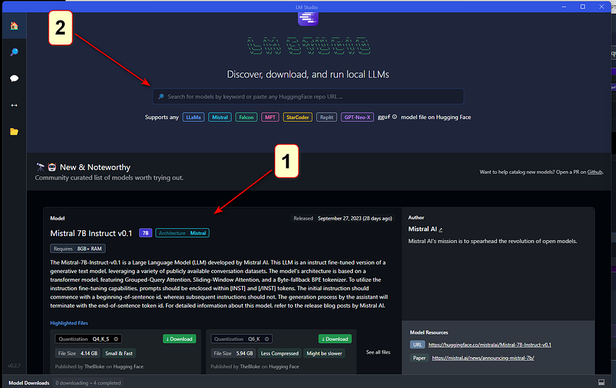

* Machine learning algorithms take the data and the results as an input to identify the patterns using machine learning algorithms to build analytical models.
* For example, Financial institutions use their customer’s transactional data and machine learning algorithms like clustering to identify patterns of fraud or legitimate transactions.
* In machine learning, you need to deal with lots of experimentation and ensure model traceability and compare model metrics and hyperparameters for all the different experiments.
* What if you could automate and monitor all steps of an ML system?
* [MLOps ](https://medium.com/swlh/a-basic-understanding-of-ml-ops-a9f289afaf27)is an ML engineering culture and practice to unify ML system development (Dev) and ML system operation (Ops) where Data scientists, data Engineers, and Operations teams collaborate.
* 


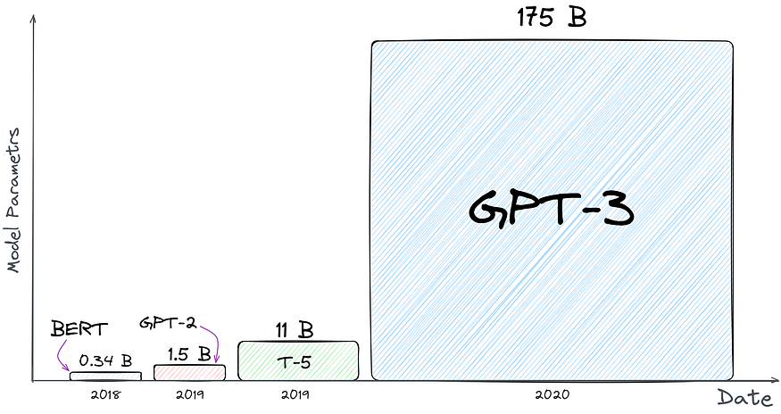

* ML Ops build the ML pipeline to encompass all stages of Machine Learning:
    * Data extraction
    * Data exploration and validation
    * Data curation or data preprocessing
    * Feature analysis
    * Model training and evaluation
    * Model validation
    * Model deployment or model serving 
    * Model monitoring for data drift and concept drift

    


* How does ML Ops help?
    * To leverage machine learning models, you need to curate the data by applying data preprocessing techniques, perform feature analysis to identify the best features for the model prediction, train the model on the selected features, perform error analysis on the model, deploy the model and then monitor the model for any data drift or concept drift. If the model degrades performance, retrain the model again by repeating the steps from data curation to deployment and monitoring.
    * ML Ops helps with Continuous Integration(CI) for data and models, Continuous Training(CT) of models, and then Continuous Deployment(CD) of the models to Production at different locations.
    * ML Ops helps to
        * Effectively manage the full ML lifecycle.
        * Creates a Repeatable and Reusable ML Workflow for consistent model training, deployment, and maintenance.
        * Innovation can be made easy and faster by building repeatable workflows to train, evaluate, deploy, and monitor different models.
        * Track different versions of model and data to enable auditing
        * Easy Deployment to production with high precision

    **AIOps**

    * AIOps is understood in general to be defined as  **_Artificial Intelligence for IT Operations (it should be AI4ITOps)_**
    * The term originally was much broader than that
    * Data from different systems are digitized, and organizations are going through digital  transformation and striving to have a data-driven culture. 
    * IT Operations teams now need to monitor these voluminous, complex, and relatively opaque datasets to troubleshoot issues and complete routine operational tasks much faster than before.
    * Due to the complexity and constant changes to IT Systems, platforms are needed to derive insights from the operational data throughout the application life cycle.
    * AIOps applies analytics and machine learning capabilities to IT operations data 
        * to separate significant events from noise in the operation data 
        * to identify root causes  
        * to prescribe resolutions
    * Per Gartner
        * _AI Ops platform ingest, index and normalize events or telemetry data from multiple domains, vendors, and sources, including infrastructure, networks, apps, the cloud, or existing monitoring tools._
* AI Ops platforms enable data analytics using machine learning methods, including real-time analysis at the point of ingestion and historical analysis of stored operational data like system logs, metrics, network data, incident-related data, etc.
* How does AIOps help? Well, It helps by focusing businesses on
    * Increasing IT operations efficiency by uncovering IT incidents insights, measuring the effectiveness of the IT applications serving business needs, and performing cause-and-effect analysis of peak usage traffic patterns.
    * Promoting innovation: Fosters innovation by removing manual monitoring of production systems by providing high-quality application diagnostics.
    * Lowering the operational cost as it decreases mean time to resolution(MTTR) and drastically reduces costly downtime, increasing overall productivity and efficiency.
    * Accelerating the return on investment by enabling teams to collaborate towards a faster resolution

    


* Per Gartner
    * There is no future of IT operations that does not include AIOps. This is due to the rapid growth in data volumes and pace of change exemplified by rate of application delivery and event-driven business models that cannot wait on humans to derive insights.
* Future of AI-Assisted IT Operations
    * The Future of AI-assisted IT Operations is to have prescriptive advice from the platform, triggering action.

    


* So in summary,
    * DevOps co-opts development, quality assurance, and operations  involving people, processes, and technology to streamline the software development lifecycle and reduced mean time to resolution
    * MLOps is a discipline that combines Machine Learning, Data Engineering, and Dev Ops to build automated ML pipelines for Continuous Training and CI/CD to manage the full ML lifecycle effectively
    * AIOps is a platform to monitor and automate the data and information flowing from IT applications that utilizes big data, machine learning, and other advanced analytics technologies

**<span style="text-decoration:underline;">Section 4________________________________________</span>**

**Back to the Basics: Data Collection and Data Management**


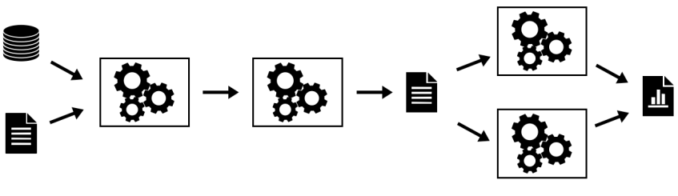


* MLOps requires highly disciplined data collection and management. 
* It is particularly needed when the outcomes could affect people’s careers, students' lives and educational organization’s reputations.
* Towards that,  let us take a look at framework used as the basis to make some very important decisions:

[https://github.com/keshavaspanda/openneuro](https://github.com/keshavaspanda/openneuro)

The Data Submission Process


**Let’s consider our context and ask ourselves the following questions:**


* Could Modalities be equivalent to Disciplines? 
* What are the Discipline independent metadata and discipline dependent metadata
* For each discipline, what metadata can we standardize on? 
* What could be our equivalent to the BIDS validator? 
* Are there existing standards that we can leverage to this data? 


### **Understanding Responsible and FAIR Data Collection in this context**


* There is growing recognition of the importance of data sharing for scientific progress 
* However, not all shared data is equally useful. 
* The FAIR principles have formalized the notion that in order for shared data to be maximally useful, they need to be **findable**, **accessible**, **interoperable**, and **reusable**. 
* An essential necessity for achieving these goals is that the data and associated metadata follow a common standard for organization, so that data users can easily understand and **reuse **the shared data. 
* The AI4Edu data archive will enable FAIR-compliant data sharing for a growing range of education data types through the use of a common community standard, the Educational Data Structure (EDS)  .
* Data sharing has become well established in education and Datasets collected about education and educational processes have provided immense value to the field and have strongly demonstrated the utility of shared data. 
* However, their scientific scope is necessarily limited, given that each dataset includes only a limited number of tasks and measurement types. 
* Beyond these large focused data sharing projects, there is a ‘long tail’ of smaller datasets that have been collected in service of specific research questions in education. 
* Making these available is essential to ensure **reproducibility **as well as to allow aggregation across many different types of measurements in service of novel scientific questions. 
* The AI4Edu archive will address this challenge by providing researchers with the ability to easily share a broad range of education data types in a way that adheres to the FAIR principles.

**Core principles of the Data Archive**

**_Sharing only upon gaining permissions_**


* There is a range of restrictiveness across data archives with regard to their data use agreements. 
* At one end of the spectrum are highly restricted databases which require researchers to submit their scientific question for review and requires the consortium to be included as a corporate author on any publications. 
* The other pole of restrictiveness  releases data (by default) under a Creative Commons Zero (CC0) Public Domain Dedication which places no restrictions on who can use the data or what can be done with them. 
* While not legally required, researchers using the data are expected to abide by community norms and cite the data following the guidelines included within each dataset. 
* The primary motivation for this policy is that it makes the data maximally accessible to the largest possible number of researchers and citizen-scientists.
* In the AI4Edu data archive effort we will strike a balance and provide ABAC over the data. 
* Subsequently we will create DIDs and ensure that personal data is always in the control of the individual who owns that data. 

**_Standards-focused data sharing_**


* To ensure the utility of shared data for the purposes of efficient discovery, reuse, and reproducibility, standards are required for data and metadata organization. 
* These standards make the structure of the data clear to users and thus reduce the need for support by data owners and curation by repository owners, as well as enabling automated QA, preprocessing, and analytics. 
* Unfortunately, most prior data sharing projects in this space have relied upon custom organizational schemes, which can lead to misunderstanding and can also require substantial reorganization to adapt to common analysis workflows. 
* The need for a clearly defined standard for data emerged from experiences in the other projects where the repository had developed a custom scheme for data organization and file naming, this scheme was ad hoc and limited in its coverage, and datasets often required substantial manual curation (involving laborious interaction with data owners). 
* In addition, there was no built in mechanism to **_directly validate whether a particular dataset met the standard_**.
* For these reasons, we focus at the outset of the AI4Edu project on developing a robust data organization standard that could be implemented in an automated validator. 
* We will engage representatives from the education community to establish a standard as a community standard for a broad and growing range of education data types. 
* EDS will define a set of schemas for file and folder organization and naming, along with a schema for metadata organization. 
* The framework was inspired by the existing data organization frameworks used in many organizations, so that transitioning to the standard is relatively easy for most researchers. 
* One of the important features of EDS is its extensibility; using a scheme inspired by open-source software projects, community members can propose extensions to EDS that encompass new data types. 
* All data uploaded to OpenEdu must first pass an EDS validation step, such that all data in OpenEdu are compliant with the EDS specifications at upload time. 
* Conversely, the Edu4AI  team will make substantial contributions to the EDS standard and validator. 
* As a consequence, this model maximizes compatibility with processing and analysis tools but more importantly, it effectively minimizes the potential for data misinterpretation (e.g., when owner and reuser have slightly different definitions of a critical acquisition parameter). Through the adoption of EDS, OpenEdu can move away from project- or database-specific data structures designed by the owner or the distributor (as used in earlier projects) and toward a uniform and unambiguous representation model agreed upon by the research community prior to sharing and reuse.


#### **FAIR sharing**


* The FAIR principles have provided an important framework to guide the development and assessment of open data resources. 
* AI4Edu will implement these principles.
* Findable: 
    * Each dataset within AI4Edu is associated with metadata, both directly from the dataset along with additional dataset-level metadata provided by the submitter at time of submission. 
    * Both data and metadata are assigned a persistent unique identifier (Digital Object Identifier [DOI]). 
    * Within the repository, a machine-readable summary of the metadata is collected by the  validator and indexed with an ElasticSearch mapping. 
    * In addition, dataset-level metadata are exposed according to the [schema.org](https://schema.org/) standard, which allows indexing by external resources such as Google Dataset Search.
    * Accessible: Data and metadata can be retrieved using a number of access methods (directly from Amazon S3, using the command line tool, or using DataLad) via standard protocols (http/https). 
    * Metadata are also accessible programmatically via a web API. Metadata remains available even in the case that data must be removed (e.g., in cases of human subjects concerns). 
    * Authentication is necessary to access the data.
* Interoperable: 
    * The data and metadata use the EDS standard to ensure accessible representation and interoperation with analysis workflows. 
    * 
* Reusable: 
    * The data are released with a clear data use agreement. 
    * Through use of the standard, the data and metadata are consistent with community standards in the field.
* **Data versioning and preservation**
    * AI4Edu will keep track of all changes in stored datasets and allows researchers to unambiguously report the exact version of the data used for any analysis. 
    * AI4Edu will preserve all versions of the data through the creation of ‘snapshots’ that unequivocally point to one specific point in the lifetime of a dataset. 
    * Data management and snapshots are supported by DataLad, a free and open-source distributed data management system.
* **Protecting privacy and confidentiality of data**
    * There is a direct relationship in data sharing between the openness of the data and their reuse potential; all else being equal, data that are more easily or openly available will be more easily and readily reused. 
    * However, all else is not equal, as openness raises concern regarding risks to subject privacy and confidentiality of data in human subjects research. 
    * Researchers are ethically bound to both minimize the risks to their research participants (including risks to confidentiality) and to maximize the benefits of their participation. 
    * Because sharing of data will necessarily increase the potential utility of the data, researchers are ethically bound to share human subject data unless the benefits of sharing are outweighed by risks to the participant.
    * In general, risks to data privacy and confidentiality are addressed through deidentification of the data to be shared. 
    * De-identification can be achieved through the removal of any of 18 personal identifiers, unless the researcher has knowledge that the remaining data could be re-identified (known as the ‘safe harbor’ method). 
    * All data shared through OpenEdu must have the 18 personal identifiers outlined by HIPAA unless an exception is provided in cases where an investigator has explicit permission to openly share the data, usually when the data are collected by the investigator themself. 
    * At present, data are examined by a human curator to ensure that this requirement has been met. 
    * Truly informed consent requires that subjects be made aware that their data may be shared. 
    * Researchers planning to share their data via the data sharing portal use a consent form (could be based on the Open Brain Consent form), which includes language that ensures subject awareness of the intent to share and its potential impact on the risk of participating. 


#### **<span style="text-decoration:underline;">Open source</span>**


* The entirety of the code for AI4Edu will be available under a permissive open-source software license (MIT License) at github.
* This enables any researcher who wishes to reuse part or all of the code or to run their own instance of the platform.

**<span style="text-decoration:underline;">Section 5________________________________________</span>**

**Data Analysis, Data Visualization, Data Lake Houses and Analytics Dashboards **


* Once data is “FAIR” ly collected and placed in an archive, it needs to be checked for quality, analyzed, visualized profiled and then models need to be selected, trained (on the curated data), tested and served up for use.
* That requires data management and analytics capabilities that can deal with structured, semi-structured and unstructured data with the data lake capturing all of the data. 
* The data warehouse dealing with structured data and the analytical dashboards surfacing both structured and unstructured content and visualization. 
* This is where the data lake house architecture has become popular.  
* As the name suggests, a data lake house architecture combines a [data lake](https://www.dremio.com/wiki/data-lake/) and a [data warehouse](https://www.dremio.com/wiki/data-warehouse/). 
* Although it is not just a mere integration between the two, the idea is to bring the best out of the two architectures: the reliable transactions of a data warehouse and the scalability and low cost of a data lake.
* Over the last decade, businesses have been heavily investing in their data strategy to be able to deduce relevant insights and use them for critical decision-making. 
* This has helped them reduce operational costs, predict future sales, and take strategic actions.
* A lake house is a new type of data platform architecture that:
* Provides the data management capabilities of a data warehouse and takes advantage of the scalability and agility of data lakes
* Helps reduce data duplication by serving as the single platform for all types of workloads (e.g., BI, ML)
* Is cost-efficient
* Prevents vendor lock-in and lock-out by leveraging open standards


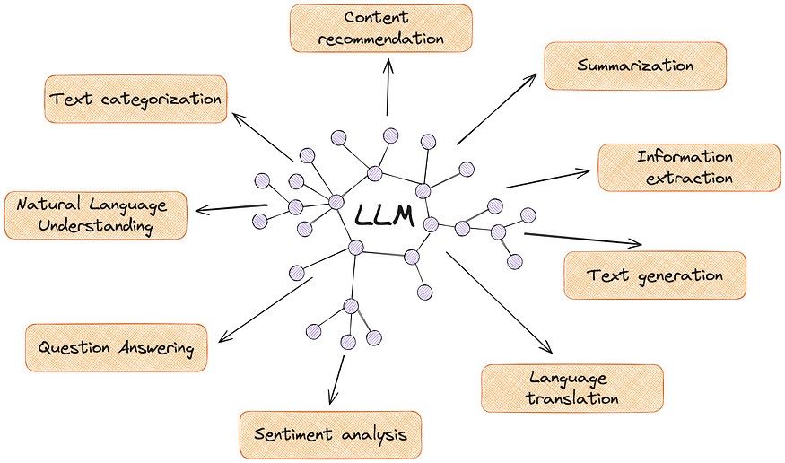


### **Evolution of the Data Lakehouse**


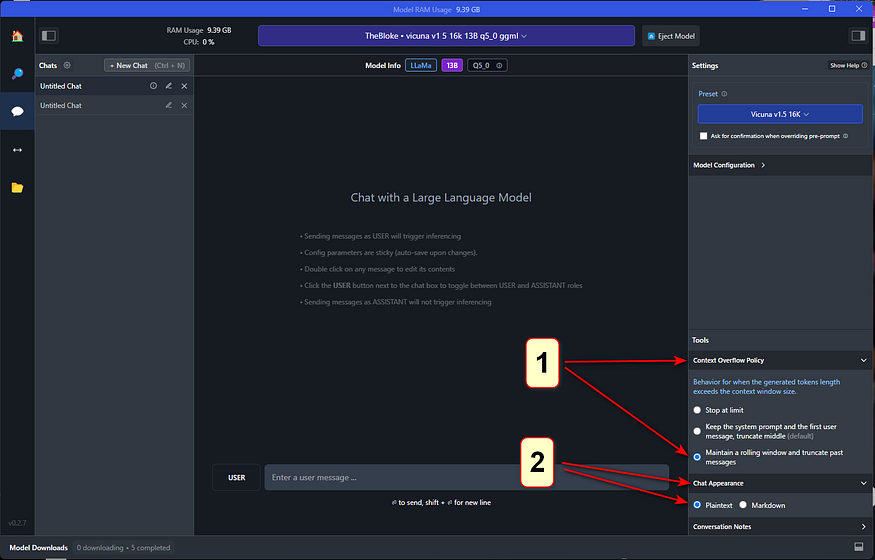


* [Data Lake House](https://www.dremio.com/resources/guides/what-is-a-data-lakehouse/) is a relatively new term in big data architecture and has evolved rapidly in recent years. It combines the best of both worlds: the scalability and flexibility of data lakes, and the reliability and performance of data warehouses. 
* Data lakes, which were first introduced in the early 2010s, provide a centralized repository for storing large amounts of raw, unstructured data. 
* Data warehouses, on the other hand, have been around for much longer and are designed to store structured data for quick and efficient querying and analysis. 
* However, data warehouses can be expensive and complex to set up, and they often require extensive data transformation and cleaning before data can be loaded and analyzed. 
* Data lake houses were created to address these challenges and provide a more cost-effective and scalable solution for big data management.
* With the increasing amount of data generated by businesses and the need for fast and efficient [data processing](https://www.dremio.com/wiki/data-processing/), the demand for a data lake house has grown considerably. As a result, many companies have adopted this new approach, which has evolved into a central repository for all types of data in an organization.


---


### **What Does a Data Lake House Do?**

There are four key problems in the world of data architecture that data lake houses address: 


* Solves the issues related to data silos by providing a centralized repository for storing and managing large amounts of structured and unstructured data. 
* Eliminates the need for complex and time-consuming data movements, reducing the latency associated with shifting data between systems.
* Enables organizations to perform fast and efficient data processing, making it possible to quickly analyze and make decisions based on the data. 
* Finally, a data lake house provides a scalable and flexible solution for storing large amounts of data, making it possible for organizations to easily manage and access their data as their needs grow.

Data warehouses are designed to help organizations manage and analyze large volumes of structured data.


---


### **How Does a Data Lake House Work?**


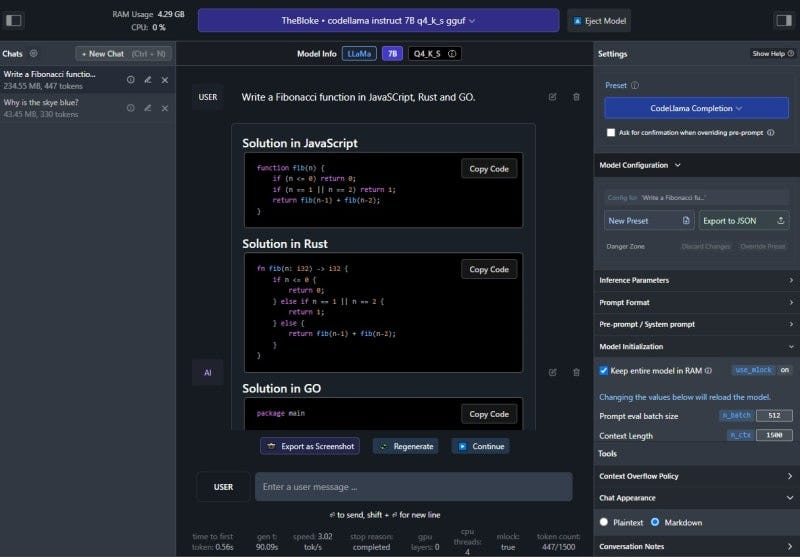


* A data lakehouse operates by utilizing a multi-layer architecture that integrates the benefits of data lakes and data warehouses. 
* It starts with ingesting large amounts of raw data, including both structured and unstructured formats, into the data lake component. 
* This raw data is stored in its original format, allowing organizations to retain all of the information without any loss of detail. 
* From there, advanced data processing and transformation can occur using tools such as [Apache Spark](https://spark.apache.org/) and Apache Hive. 
* The processed data is then organized and optimized for efficient querying in the data warehouse component, where it can be easily analyzed using SQL-based tools. 
* The result is a centralized repository for big data management that supports fast and flexible data exploration, analysis, and reporting. 
* The data lakehouse's scalable infrastructure and ability to handle diverse data types make it a valuable asset for organizations seeking to unlock the full potential of their big data.


---


### **Elements of a Data Lakehouse**

Data lake houses have a range of elements to support organizations’ data management and analysis needs. 


* A key element is the ability to store and process a variety of data types including [structured, semi-structured, and unstructured data](https://www.dremio.com/wiki/structured-vs-unstructured-data/). 
* They provide a centralized repository for storing data, allowing organizations to store all of their data in one place, making it easier to manage and analyze. 
* The data management layer enables data to be governed, secured, and transformed as needed. 
* The data processing layer provides analytics and machine learning capabilities, allowing organizations to quickly and effectively analyze their data and make data-driven decisions. 
* Another important element of a data lakehouse is the ability to provide real-time processing and analysis, which enables organizations to respond quickly to changing business conditions. 


---


### **Cloud Data Lake**


* Data lake houses are often spoken in tandem with [cloud data lakes](https://www.dremio.com/resources/guides/cloud-data-lakes/) and cloud data warehouses. With the increasing adoption of cloud-based solutions, many organizations have turned to cloud data lakes to build their data platforms. 
* Cloud data lakes provide organizations with the flexibility to scale storage and compute components independently, thereby optimizing their resources and improving their overall cost efficiency. 
* By separating storage and computing, organizations can store any amount of data in open file formats like [Apache Parquet](https://www.dremio.com/resources/guides/intro-apache-parquet/) and then use a computing engine to process the data. 
* Additionally, the elastic nature of cloud data lakes enables workloads – like machine learning – to run directly on the data without needing to move data out of the data lake.

Despite the many benefits of cloud data lakes, there are also some potential drawbacks: 


* One challenge is ensuring the quality and governance of data in the lake, particularly as the volume and diversity of data stored in the lake increases.
* Another challenge is the need to move data from the data lake to downstream applications – such as business intelligence tools – which often require additional data copies and can lead to job failures and other downstream issues. 
* Additionally, because data is stored in raw formats and written by many different tools and jobs, files may not always be optimized for query engines and low-latency analytical applications.+

**Lets start up a Dremio DataLakehouse with MinIO and Apache Superset Dashboards **

<span style="text-decoration:underline;">First create a Dremio cloud account:</span>

[https://www.dremio.com/resources/tutorials/from-signup-to-subsecond-dashboards-in-minutes-with-dremio-cloud/](https://www.dremio.com/resources/tutorials/from-signup-to-subsecond-dashboards-in-minutes-with-dremio-cloud/)

**<span style="text-decoration:underline;"> Then let’s try out this: [https://github.com/developer-advocacy-dremio/quick-guides-from-dremio/blob/main/guides/superset-dremio.md](https://github.com/developer-advocacy-dremio/quick-guides-from-dremio/blob/main/guides/superset-dremio.md)</span>**


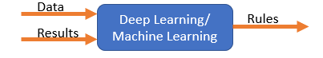


---


### **Cloud Data Warehouse**


* The first generation of on-premises data warehouses provide businesses with the ability to derive historical insights from multiple data sources. 
* However, this solution required significant investments in terms of both cost and infrastructure management. In response to these challenges, the next generation of data warehouses leveraged cloud-based solutions to address these limitations.
* One of the primary advantages of cloud data warehouses is the ability to separate storage and computing, allowing each component to scale independently. This feature helps to optimize resources and reduce costs associated with on-premises physical servers. 
* However, there are also some potential drawbacks to using cloud data warehouses: 
* While they do reduce some costs, they can still be relatively expensive.
* Additionally, running any workload where performance matters often requires copying data into the data warehouse before processing, which can lead to additional costs and complexity. 
* Moreover, data in cloud data warehouses is often stored in a vendor-specific format, leading to lock-in/lock-out issues, although some cloud data warehouses do offer the option to store data in external storage. 
* Finally, support for multiple analytical workloads, particularly those related to unstructured data like machine learning, is still unavailable in some cloud data warehouses.


---


### **Future of the Data Lakehouse**


* Upon discussion of data lake houses, their elements, and what they do, it’s only natural to look at the implications of this technology moving forward. 
* The future looks very promising, as more and more organizations are embracing big data and the need for flexible, scalable, and cost-effective solutions for managing it continues to grow. 
* In the coming years, expect to see increased adoption of data lake houses, with organizations of all sizes and across all industries recognizing their value in providing a unified platform for managing and analyzing big data. 
* Additionally, expect to see continued innovation and advancements in data lakehouse technology, such as improved data processing and transformation capabilities, enhanced security and governance features, and expanded integration with other data management tools and technologies.
* The rise of machine learning and artificial intelligence will drive the need for flexible and scalable big data platforms that can support the development and deployment of these advanced analytics models. 
* The future of data lake houses will also be influenced by the increasing importance of data privacy and security, and we can expect to see data lake houses evolving to meet these new requirements, including better data masking and data encryption capabilities. 
* Overall, the future of data lake houses looks bright, and they are likely to play an increasingly critical role in helping organizations extract value from their big data.

**<span style="text-decoration:underline;">Section 6________________________________________</span>**

**Model Training, Model Serving and ML Ops**


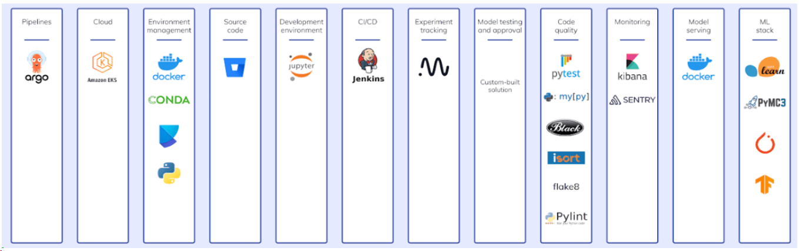
**MLOps vs LLMOps**


* While LLMOps borrows heavily from MLOps, the differences are notable.
*  The model training approach in LLMs leans more towards fine-tuning or prompt engineering rather than the frequent retraining typical of traditional Machine Learning (ML).
*  In LLMOps, human feedback becomes a pivotal data source that needs to be incorporated from development to production, often requiring a constant human feedback loop in contrast to traditional automated monitoring.
* Automated quality testing faces challenges and may often require human evaluation, particularly during the continuous deployment stage. Incremental rollouts for new models or LLM pipelines have become the norm.
*  This transition might also necessitate changes in production tooling, with the need to shift serving from CPUs to GPUs, and the introduction of a new object like a vector and graph databases  into the data layer.
* Lastly, managing cost, latency, and performance trade-offs becomes a delicate balancing act, especially when comparing self-tuned models versus paid third-party LLM APIs.

    **Continuities With Traditional MLOps**

* Despite these differences, certain foundational principles remain intact.
* The dev-staging-production separation, enforcement of access controls, usage of Git and model registries for shipping pipelines and models, and the Data Lake architecture for managing data continue to hold ground. 
* Also, the Continuous Integration (CI) infrastructure can be reused, and the modular structure of MLOps, focusing on the development of modular data pipelines and services, remains valid.
* Exploring LLMOps Changes
* As we delve deeper into the changes brought by LLMOps, we will explore the operational aspects of Language Learning Models (LLMs), creating and deploying LLM pipelines, fine-tuning models, and managing cost-performance trade-offs.
* Differentiating between ML and Ops becomes crucial, and tools like MLflow, LangChain, LlamaIndex, and others play key roles in tracking, templating, and automation. 
* Packaging models or pipelines for deployment, scaling out for larger data and models, managing cost-performance trade-offs, and gathering human feedback become critical factors for assessing model performance. 
* Moreover, the choice between deploying models versus deploying code, and considering service architecture, become essential considerations, especially when deploying multiple pipelines or fine-tuning multiple models.


**A Minimal LLMOps pipeline**

[https://github.com/keshavaspanda/BigBertha](https://github.com/keshavaspanda/BigBertha)** **


### 
**LLMOps Capabilities **


#### 
**1. LLM Monitoring**

The framework utilizes Prometheus to monitor LLM (Large Language Model) serving modules. For demo purposes, a Streamlit app is used to serve the LLM, and Prometheus scrapes metrics from it. Alerts are set up to detect performance degradation.


#### 
**2. Auto-triggering LLM Retraining/Fine-tuning**

 Prometheus triggers alerts when the model performance degrades. These alerts are managed by AlertManager, which uses Argo Events to trigger a retraining pipeline to fine-tune the model.


#### 
**3. Training, Evaluating, and Logging the Retrained LLM**

The retraining pipeline is orchestrated using Argo Workflows. This pipeline can be tailored to perform LLM-specific retraining, fine-tuning, and metrics tracking. MLflow is used for logging the retrained LLM.


#### 
**4. Triggering the Generation of New Vectors for Fresh Data**

 MinIO is used for unstructured data storage. Argo Events is set up to listen for upload events on MinIO, triggering a vector ingestion workflow when new data is uploaded.


#### 
**5. Ingesting New Vectors into the Knowledge Base**

Argo Workflows is used to run a vector ingestion pipeline that utilizes LlamaIndex for generating and ingesting vectors. These vectors are stored in Milvus, which serves as the knowledge base for retrieval-augmented generation.


### 
**Stack Overview**

This stack relies on several key components:


* ArgoCD: A Kubernetes-native continuous delivery tool that manages all components in the BigBertha stack.
* Argo Workflows: A Kubernetes-native workflow engine used for running vector ingestion and model retraining pipelines.
* Argo Events: A Kubernetes-native event-based dependency manager that connects various applications and components, triggering workflows based on events.
* Prometheus + AlertManager: Used for monitoring and alerting related to model performance.
* LlamaIndex: A framework for connecting LLMs and data sources, used for data ingestion and indexing.
* Milvus: A Kubernetes-native vector database for storing and querying vectors.
* MinIO: An open-source object storage system used for storing unstructured data.
* MLflow: An open-source platform for managing the machine learning lifecycle, including experiment tracking and model management.
* Kubernetes: The container orchestration platform that automates the deployment, scaling, and management of containerized applications.
* Docker Containers: Docker containers are used for packaging and running applications in a consistent and reproducible manner.

### 
**Demo Chatbot**


As a demonstration, the framework includes a Streamlit-based chatbot that serves a Llama2 7B quantized chatbot model. 

A simple Flask app is used to expose metrics, and Redis acts as an intermediary between Streamlit and Flask processes.

**<span style="text-decoration:underline;">Section 7________________________________________</span>**

** Pipeline Debt, Data Testing, Model Testing in MLOps **


* You are now part of a data science team at your organization 
* Your team has a number of machine learning models in place
* Their outputs guide critical business decisions, as well as dashboards displaying important financial KPIs 
* These KPIs are closely watched by your executives day/night 
* Early AM, as you are navigating traffic to your office, you suddenly start receiving multiple messages, calls and emails (simultaneously) 
* These are from your manager as well as other teams and from senior management 
* They are all complaining about the same thing: The high visibility business metrics dashboard that you and your team had built the pipelines & dashboards for and deployed as well as many of the dashboards  that many other teams were using (which you did not know until today) were displaying what seemed to be random numbers (except every full hour, when the KPIs look okay for a short time) 
* The financial models that are part of the pipelines are predicting the company’s insolvency looming fast.
* Once you get in and hurriedly try to put in some quick fixes in the pipeline (excluding predictions beyond thresholds etc.) you find out that every fix results in your data engineering and research teams reporting new broken services and models in the pipelines.
* This is the **_Debt Collection Day scenario_** we are trying to avoid desperately here. 
* Of all debts in data engineering the most vengeful unpaid debt is Pipeline Debt. 

**The roots of  Pipeline Debt _(aka The road to hell is paved with good intentions)_**


* A few months ago You were just about to start that new exciting machine learning project. 
* You had located useful data scattered around your company’s databases, [feature stores](https://neptune.ai/blog/feature-stores-components-of-a-data-science-factory-guide), documents, videos, audios and spreadsheets belonging to employees which they (reluctantly) gave you access to (cross silo collaboration is hard). 
* To make the data usable, you constructed a data pipeline: a set of jobs and Python functions that ingest, process, clean and combine all these data. 
* The pipeline feeds the data into a machine learning model. 
* The entire process is depicted schematically below.

    

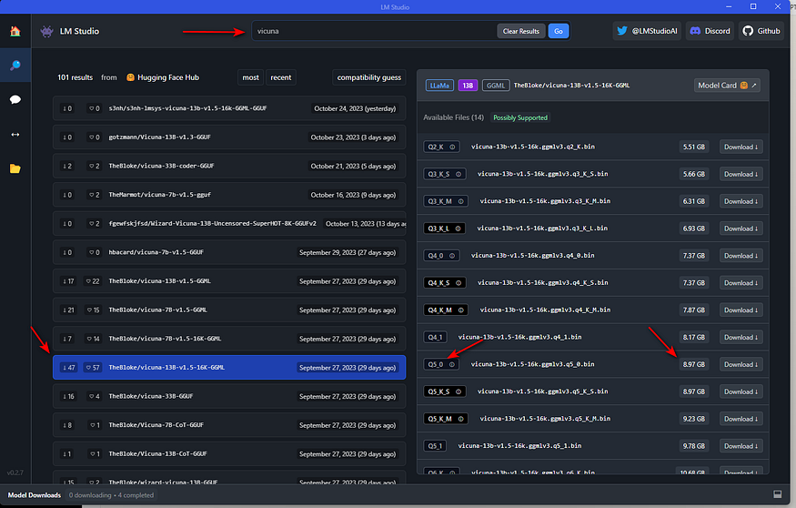
Simple manageable data pipelines 


The first data pipelines worked well, consistently populating the downstream machine learning model with data, which turned it into accurate predictions. 

However, the model deployed as a service in the cloud was not very actionable.To make it more useful, you built a set of dashboards for presenting the model’s output as well as important KPIs to the business stakeholders, The pipeline deepened


    


Extended pipelines


* You were telling a colleague from the research team about your project over lunch who decided to do something similar with their data, making the company’s data pipeline wider and cross-team-border.

    


    More pipelines, more complexity 

* A few weeks later the two of you who were informally collaborating on these dashboards got together and talked about each of your pipelines and dashboards. 
* As you’ve learned more about what the research team was up to, both of you noticed how useful and valuable it would be if your two teams used each other’s data for powering your respective models and analyses. 
* Upon implementing this idea, the company’s data pipeline was looking like this.

    


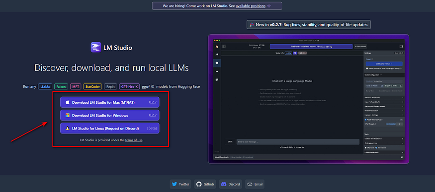
If multiple pipelines exist, they will inevitably blend

* This diagram should have made you flinch – what they show is **_accumulating pipeline debt_** which is technical debt in data pipelines 
* It arises when your data pipelines are triple-U: **_Undocumented, Untested, Unstable_**
* It comes in many flavors but all share some characteristics. 
* The system is entangled; so, a change in one place can derail a different process elsewhere. 
* This makes code refactoring and debugging exceptionally hard. 
* For a software engineer, this will sound like a solved problem 
* The solution is called automated testing. 
* However, testing software is very different from testing data in two major ways:
    * First, while you have full control over your code and can change it when it doesn’t work, you can’t always change your data; in many cases, you are merely an observer watching data as it comes, generated by some real-world process.
    * Second, software code is always right or wrong: either it does what it is designed to do, or it doesn’t. Data is never right or wrong. It can only be suitable or not for a particular purpose. 
* This is why automated testing needs a special approach when data is involved.

**Testing machine learning models**


* Fundamentally when testing ML Models, we are asking the question: “Do we know if the model actually works?” 
* We want to be sure that the learned model will behave consistently and produce the results expected of it **_per expectation. _**

    


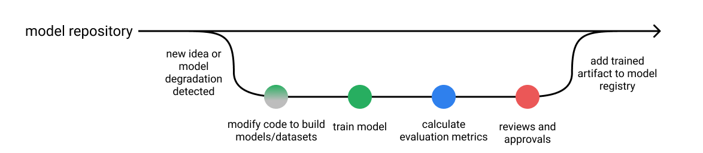


**_A typical workflow for software development._**


* In traditional software development, when we run our testing suite against the code, we'll get a report of the specific behaviors that we've written tests around and verify that our code changes don't affect the expected behavior of the system. 
* If a test fails, we'll know which specific behavior is no longer aligned with our expected output. 
* We can also look at this testing report to get an understanding of how extensive our tests are by looking at metrics such as [code coverage](https://en.wikipedia.org/wiki/Code_coverage?ref=jeremyjordan.me).

    


* Unlike traditional software applications, it is not as straightforward to establish a standard for testing ML applications 
* This is because the tests do not just depend on the software, they also rely on
    * the business context
    * problem domain
    * the dataset used
    * the model selected. 
* Most teams are comfortable using model [evaluation metrics](https://neptune.ai/blog/performance-metrics-in-machine-learning-complete-guide) to quantify a model’s performance before deploying it, but [these metrics are just not enough](https://www.jeremyjordan.me/testing-ml#what-s-the-difference-between-model-testing-and-model-evaluation) to ensure ML models are ready for production deployment and use. 
* Contrast a typical software development workflow with one for developing machine learning systems. 
    * After training a new model, we'll typically produce an evaluation report including:
    * performance of an established metric on a validation dataset,
    * plots such as precision-recall curves,
    * operational statistics such as inference speed,
    * examples where the model was most confidently incorrect,

**We will rigorously follow practices such as:**


* Save all of the hyper-parameters used to train the model along with the model,
* Only promote models which offer an **_improvement _**over the existing model (or baseline) when evaluated on the same dataset.

    


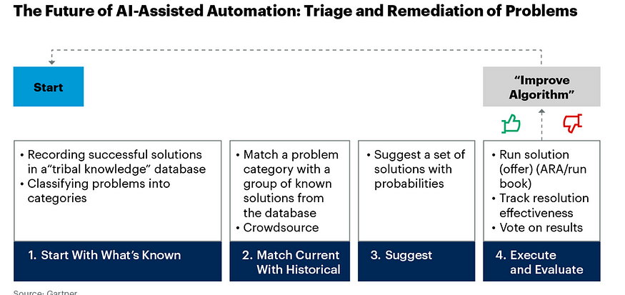
A typical workflow for model development.

* When reviewing a new machine learning model, we'll inspect metrics and plots which summarize model performance over a validation dataset. 
* We're able to compare performance between multiple models and make relative judgements, but we're not immediately able to characterize specific model behaviors. 
* For example, figuring out **_where_ **the model is failing usually requires additional investigative work 
* One common practice here is to look through a list of the top most egregious model errors on the validation dataset and manually categorize these failure modes.
* Assuming we write behavioral tests for our models (discussed below), there's also the question of whether or not we have **_enough _**tests! 
* While traditional software tests have metrics such as the lines of code covered when running tests, this becomes harder to quantify when you shift your application logic from lines of code to **_parameters of a machine learning model_**. 
* Do we want to quantify our test coverage with respect to the input data distribution? Or perhaps the possible **_activations _**inside the model?
* _[Odena et al](http://proceedings.mlr.press/v97/odena19a/odena19a.pdf?ref=jeremyjordan.me). introduce one possible metric for coverage where we track the model logits for all of the test examples and quantify the area covered by radial neighborhoods around these activation vectors. _
* _As an industry we **don't **have well-established standards here _
* _Testing for machine learning systems is in early days _
* _The question of ML Model Test coverage isn't really being asked by most people (certainly not in industry)._


### **Difference between model testing and model evaluation**


* While reporting evaluation metrics is certainly a good practice for quality assurance during model development, it is insufficient. 
* Without a **granular report of specific behaviors**, we won't be able to immediately understand the nuances of how behavior may change if we switch over to the new model. 
* Additionally, we won't be able to track (and prevent) **_behavioral regressions_** for specific failure modes that had been previously addressed.
* This can be especially dangerous for machine learning systems since oftentimes failures happen silently. 
* For example, 
    * you might improve the overall evaluation metric but introduce a regression on a critical subset of data. 
    * Or you could unknowingly add a gender bias to the model through the inclusion of a new dataset during training. 
* We need more nuanced reports of model behavior to identify such cases, which is exactly where model testing can help.
* For machine learning systems, we should be running model evaluation and model tests in parallel.
* **Model evaluation** covers metrics and plots which summarize performance on a validation or test dataset.
* **Model testing** involves explicit checks for behaviors that we expect our model to follow.
* Both of these perspectives are instrumental in building high-quality models.
* In practice, most people are doing a combination of the two where evaluation metrics are calculated automatically and some level of model "testing" is done [manually through error analysis](https://www.coursera.org/learn/machine-learning-projects/lecture/GwViP/carrying-out-error-analysis?ref=jeremyjordan.me) (i.e. classifying failure modes). 
* Developing model tests for machine learning systems can offer a systematic approach towards error analysis.


### **How do you write model tests?**

There are two types of model tests needed.


* **Pre-train** **tests** allow us to identify some bugs early on and short-circuit a training job.
* **Post-train tests** use the trained model artifact to inspect behaviors for a variety of important scenarios that we define.


#### **Pre-train tests**

There are some tests that we can run without needing trained parameters. These tests include:


* check the shape of your model output and ensure it aligns with the labels in your dataset
* check the output ranges and ensure it aligns with our expectations (eg. the output of a classification model should be a distribution with class probabilities that sum to 1)
* make sure a single gradient step on a batch of data yields a decrease in your loss
* make [assertions about your datasets](https://greatexpectations.io/?ref=jeremyjordan.me)
* check for label leakage between your training and validation datasets

The main goal here is to identify some errors early so we can avoid a wasted training job.


#### **Post-train tests**


* However, in order for us to be able to understand model behaviors we'll need to test against trained model artifacts. 
* These tests aim to **interrogate the logic learned during training** and provide us with a behavioral report of model performance.

**_Reference: [Beyond Accuracy: Behavioral Testing of NLP Models with CheckList](https://homes.cs.washington.edu/~marcotcr/acl20_checklist.pdf?ref=jeremyjordan.me)_**


* Three different types of model tests can be used to understand behavioral attributes.
* **Invariance Tests**
* Invariance tests allow us to describe a set of perturbations we should be able to make to the input without affecting the model's output. 
* We can use these perturbations to produce pairs of input examples (original and perturbed) and check for consistency in the model predictions. 
* This is closely related to the concept of data augmentation, where we apply perturbations to inputs during training and preserve the original label.
* For example, imagine running a sentiment analysis model on the following two sentences:
    * Mark was a great instructor.
    * Samantha was a great instructor.
* We would expect that simply changing the name of the subject doesn't affect the model predictions.
* **Directional Expectation Tests**
* Directional expectation tests, on the other hand, allow us to define a set of perturbations to the input which _should_ have a _predictable_ effect on the model output.
* For example, if we had a housing price prediction model we might assert:
* Increasing the number of bathrooms (holding all other features constant) should not cause a drop in price.
* Lowering the square footage of the house (holding all other features constant) should not cause an increase in price.
* Let's consider a scenario where a model fails the second test - taking a random row from our validation dataset and decreasing the feature `house_sq_ft` yields a higher predicted price than the original label. 
    * This is surprising as it doesn't match our intuition, so we decide to look further into it 
    * We realize that,_ without having a feature for the house's neighborhood/location, our model has learned that smaller units tend to be more expensive; this is due to the fact that smaller units from our dataset are more prevalent in cities where prices are generally higher. _
* In this case, the _selection_ of our dataset has influenced the model's logic in unintended ways - this isn't something we would have been able to identify simply by examining performance on a validation dataset.
* **Minimum Functionality Tests (aka data unit tests)**
* Just as software unit tests aim to isolate and test atomic components in your codebase, data unit tests allow us to quantify model performance for specific cases found in your data.
* This allows you to identify critical scenarios where prediction errors lead to high consequences. 
* You may also decide to write data unit tests for failure modes that you uncover during error analysis; this allows you to "automate" searching for such errors in future models.
* Take a look at Snorkel ([https://www.snorkel.org/](https://www.snorkel.org/)) who have introduced a very similar approach through their concept of _[slicing functions](https://www.snorkel.org/use-cases/03-spam-data-slicing-tutorial?ref=jeremyjordan.me). _
* These are programmatic functions which allow us to identify subsets of a dataset which meet certain criteria. 
* For example, you might write a slicing function to identify sentences less than 5 words to evaluate how the model performs on short pieces of text.


#### **Organizing tests**


* In traditional software tests, we typically organize our tests to mirror the structure of the code repository. 
* However, this approach doesn't translate well to machine learning models since our logic is structured by the parameters of the model.
* The authors of the CheckList paper linked above recommend structuring your tests around the "skills" we expect the model to acquire while learning to perform a given task.

For example, a sentiment analysis model might be expected to gain some understanding of:


* vocabulary and parts of speech,
* robustness to noise,
* identifying named entities,
* temporal relationships,
* and negation of words.

For an image recognition model, we might expect the model to learn concepts such as:


* object rotation,
* partial occlusion,
* perspective shift,
* lighting conditions,
* weather artifacts (rain, snow, fog),
* and camera artifacts (ISO noise, motion blur).
* 

#### 
    **Model development pipeline**


    


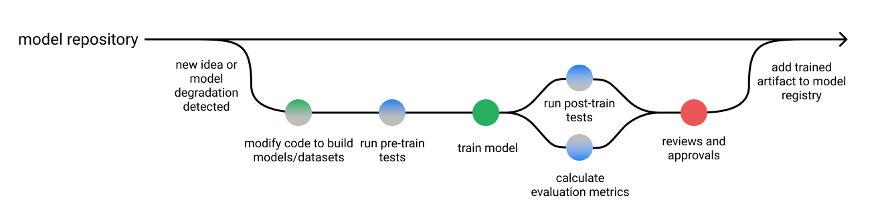


* We also need to perform thorough testing of the **_models _**to ensure they are robust enough for real-world use.
* Let's go through some of the ways we can perform testing for different scenarios.ML testing is problem-dependent. 
* This is **_not _**a template approach but rather a guide to what types of test suites you might want to establish for your application based on your use case.


**Developing, testing, and deploying machine learning models **

**Combining automated tests and manual validation for effective model testing**


* To perform ML testing in their projects, this approach involves having a few levels of tests suites, as well as validation:
* Automated tests for model verification
* Manual model evaluation and validation.
* To implement automated tests in their workflow, [GitOps](https://www.gitops.tech/) can be used. 
* [Jenkins](https://www.jenkins.io/) runs code quality checks and [smoke tests](https://en.wikipedia.org/wiki/Smoke_testing_(software)) using production-like runs in the test environment. 
* A single pipeline for model code is created where every pull request goes through code reviews and automated unit tests.
* The [pull requests](https://www.atlassian.com/git/tutorials/making-a-pull-request) also go through automated smoke tests. 
* The automated test suites’ goal was to make sure tests flagged erroneous code early in the development process.
* After the automation tests are run and passed by the model pipeline, a domain expert manually reviewed the evaluation metrics to make sure that they made sense, validated them, and marked them ready for deployment.

**Automated tests for model verification**

The workflow for the automated tests will be that whenever someone on the team made a commit, 


* the smoke test would run to ensure the code worked, 
* then the unit tests would run, making sure that the assertions in the code and data were met. 
* Finally, the integration tests would run to ensure the model works well with other components in the pipeline.

**Automated smoke test**


* Every pull request goes through automated smoke tests where the team trained models and made predictions, running the entire end-to-end pipeline on some **_small chunk of actual data_** to ensure the pipeline worked as expected and nothing broke. 
* The right kind of testing for the smoke suite can give any team a chance to understand the quality of their pipeline before deploying it. 
* Running the smoke test suite does not mean the entire pipeline is guaranteed to be fully working because the code passed. 
* The team has to consider the unit test suite to test data and model assumptions.

**Automated unit and integration tests**


* The unit and integration tests the team run will check assertions about the dataset to prevent low-quality data from entering the training pipeline and prevent problems with the data preprocessing code. 
* You could think of these assertions as assumptions the team made about the data. 
* For example, they would expect to see some kind of correlation in the data or see that the model’s prediction bounds are non-negative.
* Unit testing machine learning code is more challenging than typical software code. 
* Unit testing several aspects of the model code is very difficult for a team. 
* For example, to test accurately, teams would have to train the model, and even with a modest data set, a unit test could take a long time.
* Furthermore, some of the tests could be erratic and flaky (failed at random). 
* One of the challenges of running the unit tests to assert the data quality is that running these tests on sample datasets was more complex and took way less time than running them on the entire dataset. 
* It was difficult to fix for the team but to address the issues. 
* Some teams opt to eliminate part of the unit tests in favor of smoke tests. 
* The team defines acceptance criteria and their test suite continuously evolves as they experiment by adding new tests, and removing others, gaining more knowledge on what works and what doesn't.
* The model is trained in a production-like environment on a complete dataset for each new pull request, except that they would adjust the hyperparameters at values that resulted in quick results. Finally, they would monitor the pipeline’s health for any issues and catch them early.


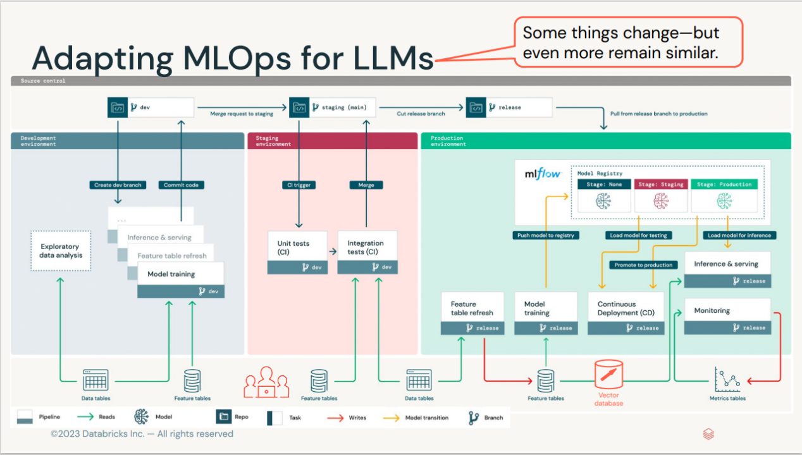
The MLOps toolstack **including testing tools**

**Manual model evaluation and validation**


* Have a human-in-the-loop framework where after training the model, reports are  created with different plots showing results based on the dataset, so the domain experts could review them before the model could be shipped.
* After training the model, a domain expert generated and reviewed a model quality report. 
* The expert would approve (or deny) the model through a manual auditing process before it could eventually be shipped to production by the team after getting validation and passing all previous tests.

**Stress Tests and A/B Tests**


* Once the pipeline generates the build (a container image), the models are stress-tested in a production-like environment through the [release pipelines](https://docs.microsoft.com/en-in/azure/devops/pipelines/build/triggers?view=azure-devops#classic-release-pipelines). 
* Depending on the use case, the team also carried out [A/B tests](https://www.seldon.io/a-b-testing-for-machine-learning/) to understand how their models performed in varying conditions before they deployed them, rather than relying purely on offline evaluation metrics. 
* With what they learned from the A/B tests, they knew whether a new model improved a current model and tuned their model to optimize the business metrics better.

**Stress testing machine learning models**


* Testing the model’s performance under extreme workloads is crucial for business applications that typically expect high traffic from users. 
* Therefore, the team performed [stress tests](https://en.wikipedia.org/wiki/Stress_testing_(software)) to see how responsive and stable the model would be under an increased number of prediction requests at a given time scale. 
* This way, they benchmarked the model’s scalability under load and identified the breaking point of the model. In addition, the test helped them determine if the model’s prediction service meets the required service-level objective (SLO) with uptime or response time metrics.
* It is worth noting that the point of stress testing the model**_ isn’t so much to see how many inference requests the model could handle as to see what would happen when users exceed such traffic._** 
* This way, you can understand the model’s performance problems, including the load time, response time, and other bottlenecks.

**Testing model quality after deployment**


* The goal of the testing production models is to ensure that the deployment of the model is successful and the model works correctly in production together with other services. For this team, testing the inference performance of the model in production was a crucial process for continuously providing business value. 
* In addition, the team tested for data and model drift to make sure models could be monitored and perhaps retrained when such drift was detected. On another note, testing production models can enable teams to perform error analysis on their mission-critical models through manual inspection from domain experts.


- An example of a dashboard showing information on data drift for a machine learning project in Azure ML Studio | [Source](https://docs.microsoft.com/en-us/azure/machine-learning/how-to-monitor-datasets?tabs=azure-studio#understand-data-drift-results)

**Drift MonitoringExample:**

[https://github.com/keshavaspanda/drift-monitoring](https://github.com/keshavaspanda/drift-monitoring)

** Behavioral tests for ML (Natural language processing (NLP) and classification tasks)**


* Business use case: The transaction metadata product at MonoHQ uses machine learning to classify transaction statements that are helpful for a variety of corporate customer applications such as credit application, asset planning/management, BNPL (buy now pay later), and payment. Based on the narration, the product classifies transactions for thousands of customers into different categories.
* Before deploying the model, the team conducts a behavioral test. This test consists of 3 elements:
* Prediction distribution,
* Failure rate,
* Latency.
* If the model passes the three tests, the team lists it for deployment. If the model does not pass the tests, they would have to re-work it until it passes the test. They always ensure that they set a performance threshold as a metric for these tests.
* They also perform A/B tests on their models to learn what version is better to put into the production environment.

**Behavioral tests to check for prediction quality**


* This test shows how the model responds to inference data, especially NLP models. 
* First, the team runs an [invariance test](https://deepchecks.com/how-to-test-machine-learning-models/#Invariance), introducing perturbability to the input data.
* Next, they check if the slight change in the input affects the model response—its ability to correctly classify the narration for a customer transaction. 
* Essentially, they are trying to answer here: does a minor tweak in the dataset with a similar context produce consistent output?

**Performance testing for machine learning models**


* To test the response time of the model under load, the team configures a testing environment where they would send a lot of traffic to the model service. Here’s their process:
* They take a large amount of transaction dataset,
* Create a table, 
* Stream the data to the model service,
* Record the inference latency,
* And finally, calculate the average response time for the entire transaction data.
* If the response time passes a specified latency threshold, it is up for deployment. If it doesn’t, the team would have to rework it to improve it or devise another strategy to deploy the model to reduce the latency. 

**A/B testing machine learning models**


* For this test, the team containerizes two models to deploy to the production system for upstream services to consume to the production system. 
* They deploy one of the models to serve traffic from a random sample of users and another to a different sample of users so they can measure the real impact of the model’s results on their users. 
* In addition, they can tune their models using their real customers and measure how they react to the model predictions. 
* This test also helps the team avoid introducing complexity from newly trained that are difficult to maintain and add no value to their users.

** Performing  model engineering and statistical tests for machine learning applications**


* This team performed two types of tests on their machine learning projects:
* Engineering-based tests (unit and integration tests),
* Statistical-based tests (model validation and evaluation metrics). 
* The engineering team ran the unit tests and checked whether the model threw errors. 
* Then, the data team would hand off (to the engineering team) a mock model with the same input-output relationship as the model they were building. 
* Also, the engineering team would test this model to ensure it does not break the production system and then serve it until the correct model from the data team is ready.
* Once the data team and stakeholders evaluate and validate that the model is ready for deployment, the engineering team will run an integration test with the original model. 
* Finally, they will swap the mock model with the original model in production if it works.

**Engineering-based test for machine learning models**


* Unit and integration tests
* To run an initial test to check if the model will integrate well with other services in production, the data team will send a mock (or dummy) model to the engineering team. 
* The mock model has the same structure as the real model, but it only returns the random output. 
* The engineering team will write the service for the mock model and prepare it for testing.
* The data team will provide data and input structures to the engineering team to test whether the input-output relationships match with what they expect, if they are coming in the correct format, and do not throw any errors. 
* The engineering team does not check whether that model is the correct model; they only check if it works from an engineering perspective. 
* They do this to ensure that when the model goes into production, it will not break the product pipeline.
* When the data team trains and evaluates the correct model and stakeholders validate it, the data team will package it and hand it off to the engineering team. 
* The engineering team will swap the mock model with the correct model and then run integration tests to ensure that it works as expected and does not throw any errors.

**Statistical-based test for machine learning models**


* The data team would train, test, and validate their model on real-world data and [statistical evaluation metrics](https://neptune.ai/blog/performance-metrics-in-machine-learning-complete-guide). 
* The head of data science audits the results and approves (or denies) the model. If there is evidence that the model is the correct model, the head of data science will report the results to the necessary stakeholders. 
* He will explain the results and inner workings of the model, the risks of the model, and the errors it makes, and confirm if they are comfortable with the results or the model still needs to be re-worked. 
* If the model is approved, the engineering team swaps the mock model with the original model, reruns an integration test to confirm that it does not throw any error, and then deploy it.
* Model evaluation metrics are **not** enough to ensure your models are ready for production. 
* You also need to perform thorough testing of your models to ensure they are robust enough for real-world encounters.
* Developing tests for ML models can help teams systematically analyze model errors and detect failure modes, so resolution plans are made and implemented before deploying the models to production.

**Automated testing with Great Expectations **


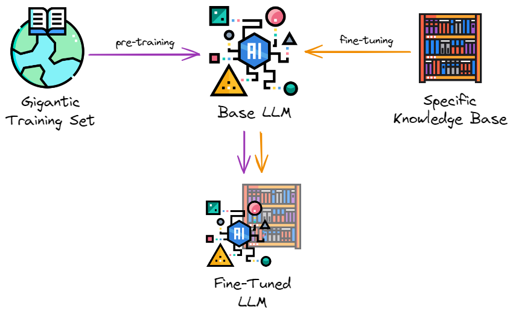


Automated testing tailored for data pipelines is the premise of Great Expectations, a widely used open-source Python package for data validation.

[https://medium.com/dataroots/great-expectations-tutorial-by-paolo-l%C3%A9onard-95e689d73702](https://medium.com/dataroots/great-expectations-tutorial-by-paolo-l%C3%A9onard-95e689d73702)


* The package is built around the concept of an expectation. 
* The expectation can be thought of as a unit test for data. It is a declarative statement that describes the property of a dataset and does so in a simple, human-readable language.
* For example, to assert that the values of the column “num_complaints” in some table in between one and five, you can write:

expect_column_values_to_be_between(

    column="num_complaints",

    min_value=1,

    max_value=5,

)


* This statement will validate your data and return a success or a failure result. 
* As we have already mentioned, you do not always control your data but rather passively observe it flowing. It is often the case that an atypical value pops up in your data from time to time without necessarily being a reason for distress. Great - Expectations accommodate this via the “mostly” keyword which allows for describing how often should the expectation be matched.

expect_column_values_to_be_between(

    column="num_complaints",

    min_value=1,

    max_value=5,

    mostly=0.95,

)


* The above statement will return success if at least 95% of “num_complaints” values are between one and five.
* In order to understand the data well, it is crucial to have some context about why we expect certain properties from it. 
* We can simply add it by passing the “meta”  parameter to the expectation with any relevant information about how it came to be. Our colleagues or even our future selves will thank us for it.

expect_column_values_to_be_between(

    column="num_complaints",

    min_value=1,

    max_value=5,

    mostly=0.95,

    meta={

        “created_by”: “Michal”,

        “craeted_on”: “28.03.2022”,

        “notes”: “number of client complaints; more than 5 is unusual”

                 “and likely means something broke”,

    }

)


* These metadata notes will also form a basis for the data documentation which Great Expectations can just generate out of thin air – but more on this later!
* The package contains several dozen expectations to use out of the box, all of them with wordy, human-readable names such as “expect_column_distinct_values_to_be_in_set”, “expect_column_sum_to_be_between”, or “expect_column_kl_divergence_to_be_less_than”. This syntax allows one to clearly state what is expected of the data and why. 
* Some expectations are applicable to column values, others to their aggregate functions or entire density distributions. Naturally, the package also makes it possible to easily create custom expectations for when a tailored solution is needed.
* Great Expectations works with many different backends. 
* You can evaluate your expectations locally on a Pandas data frame just as easily as on a SQL database (via SQLAlchemy) or on an Apache Spark cluster.
* So, how do the expectations help to reduce pipeline debt? The answer to this is multifold. 
1. 1. The process of crafting the expectations forces us to sit and ponder about our data: its nature, sources, and what can go wrong with it. This creates a deeper understanding and improves data-related communication within the team.
2. 2. By clearly stating what we expect from the data, we can detect any unusual situations such as system outages early on.
3. 3. By validating new data against a set of pre-existing expectations we can be sure we don’t feed our machine learning models garbage.
4. 4. Having the expectations defined brings us very close to having well-maintained data documentation in place. The list goes on and on.

A few specific use cases in which investing time in GE pays back a great deal are:

**Detecting data drift**


* A notorious danger to machine learning models deployed in production is [data drift](https://towardsdatascience.com/dont-let-your-model-s-quality-drift-away-53d2f7899c09). Data drift is a situation when the distribution of model inputs changes. This can happen for a multitude of reasons: data-collecting devices tend to break or have their software updated, which impacts the way data is being recorded. If the data is produced by humans, it is even more volatile as fashions and demographics evolve quickly.
* [Data drift constitutes a serious problem for machine learning models](https://neptune.ai/blog/concept-drift-best-practices). It can make the decision boundaries learned by the algorithm invalid for the new-regime data, which has a detrimental impact on the model’s performance.
* Data drift may impact the model’s performance
* You have collected and cleaned your data, experimented with various machine learning models and data preprocessing variants and fine-tuned your model’s hyperparameters to finally come up with a solution good enough for your problem. 
* Then, you’ve built a robust, automatic data pipeline, wrote an API for the model, put it in a container, and deployed it to the production environment. 
* You even made sure to check that the model runs smoothly and correctly in production. Finally, you're done! Or are you? 
* Not even close. In fact, this is just the beginning of the journey.
* There are so many things that could go wrong with a machine learning system after it has been deployed to production! 
* Broadly speaking, we can divide all these potential concerns into two buckets: statistical issues and infrastructure issues. 
* The latter comprise things like computing resources and memory (are there enough?), latency (is the model responding quickly enough?), throughput (can we answer all the incoming requests?), and so on. 
* Here, we’ll focus on the former: the statistical issues, which come in two main flavors: data drift and concept drift.
* Enters data validation. 
* In situations where data drift could be of concern, just create expectations about the model input features that validate their long-term trend, average values, or historic range and volatility. 
* As soon as the world changes and your incoming data starts to look differently, GE will alert you by spitting out an array of failed tests!

**Preventing outliers from distorting model outputs**


* Another threat to models deployed in production, slightly similar to the data drift, are outliers. 
* What happens to a model’s output when it gets an unusual value as input, typically very high or very low? 
* If the model has not seen such an extreme value during training, an honest answer for it would be to say: I don’t know what the prediction should be!
* Unfortunately, machine learning models are not this honest. Much to the contrary: the model will likely produce some output that will be highly unreliable without any warning.
* Fortunately, one can easily prevent it with a proper expectations suite! Just set allowed ranges for the model’s input features based on what it has seen in training to make sure you are not making predictions based on outliers.

**Preventing pipeline failures from spilling over**


* Data pipelines do fail sometimes. You might have missed a corner case. Or the power might have gone off for a moment in your server room. 
* Whatever the reason, it happens that a data processing job expecting new files to appear somewhere suddenly finds none.
* If this makes the code fail, that’s not necessarily bad.  
* But often it doesn’t: the job succeeds, announcing happily to the downstream systems that your website had 0 visits on the previous day. 
* These data points are then shown on KPI dashboards or even worse, are fed into models that automatically retrain. 
* Q: How do we prevent such a scenario? Expect recent data – for instance, with a fresh enough timestamp – to be there.

**Detecting harmful biases**


* Bias in machine learning models is a topic that has seen increasing awareness and interest recently. 
* This is crucial, considering how profoundly the models can impact people’s lives. The open question is how to detect and prevent these biases from doing charm.
* While by no means do they provide an ultimate answer, Great Expectations can at least help us in detecting dangerous biases. 

**Fairness**


* Fairness in machine learning is a vast and complex topic, so let us focus on two small parts of the big picture: the training data that goes into the model, and the predictions produced by it for different test inputs.
* When it comes to the training data, we want it to be fair and unbiased, whatever that means in our particular case. 
* If the data is about users, for instance, you might want to include users from various geographies in appropriate proportions, matching their global population. Whether or not this is the case can be checked by validating each batch of training data against an appropriate expectations suite before the data is allowed to be used for training.
* As for the model’s output, we might want it, for instance, to produce the same predictions for both women and men if their remaining characteristics are the same. To ensure this, just test the model on a hold-out test set and run the results against a pre-crafted suite of expectations.

**Improving team communication and data understanding.**


* Finally, we could start off by creating an empty expectations suite, that is: list all the columns, but don’t impose any checks on their values yet. 
* Then, get together people who own the data or the business processes involved and ask them:
* What is the maximal monthly churn rate that is worrisome? 
* How low does the website stickiness have to fall to trigger an alert? Such conversations can improve the data-related communication between the teams and the understanding of the data themselves in the company

**Resources**


* Great Expectations [official documentation](https://docs.greatexpectations.io/docs/). 

**Testing LLMs**


## **Testing Large Language Models with W&B and Giskard**


* Combining W&B with Giskard to deeply understand LLM behavior and avoid common pitfalls like hallucinations and injection attacks
* According to the[ Open Worldwide Application Security Project](https://www.giskard.ai/knowledge/owasp-top-10-for-llm-2023-understanding-the-risks-of-large-language-models), some of the most critical vulnerabilities that affect LLMs are prompt injection (when LLMs are manipulated to behave as the attacker wishes), sensitive information disclosure (when LLMs inadvertently leak confidential information), and hallucination (when LLMs generate inaccurate or inappropriate content).
* Giskard's scan feature ensures the identification of these vulnerabilities—and many others. 
* The library generates a comprehensive report which quantifies these into interpretable metrics. The Giskard/W&B integration allows the logging of both the report and metrics into W&B, which in conjunction with the tracing, creates the ideal combination for building and debugging LLM apps.


#### **Giskard's vulnerability scanning for LLMs**


* [Giskard](https://www.giskard.ai/) is an open-source testing framework dedicated to ML models, covering any Python model, from tabular to LLMs.
* Testing machine learning applications can be tedious: Where to start testing? Which tests to implement? What issues to cover? How do we implement the tests?
* With Giskard, data scientists can scan their model to find dozens of hidden vulnerabilities, instantaneously generate domain-specific tests, and leverage the Quality Assurance best practices of the open-source community.
* For more information, you can check Giskard's documentation following this[ link](https://docs.giskard.ai/en/latest/).
* Watch: [https://www.youtube.com/watch?v=KeY6qPAvyq0](https://www.youtube.com/watch?v=KeY6qPAvyq0)
* The better developer version: [https://www.youtube.com/watch?v=rkjFFx_nXhU](https://www.youtube.com/watch?v=rkjFFx_nXhU)


#### **W&B Traces for Debugging LLMs: **


* [Weights & Biases](https://wandb.ai/), often referred to as wandb or even simply W&B, is an MLOps platform that helps AI developers streamline their ML workflow from end to end.
* With W&B, developers can monitor the progress of training their models in real-time, log key metrics and hyperparameters, and visualize results through interactive dashboards. It[ simplifies collaboration by enabling team members to share experiments and compare model performance](https://wandb.ai/site/solutions/wb-for-teams). For more information, you can check W&B's documentation following this[ link](https://docs.wandb.ai/).
* In the context of LLMs, earlier this year, W&B introduced a new debugging tool “W&B Traces” designed to support ML practitioners working on prompt engineering for LLMs. 
* It lets users visualize and drill down into every component and activity throughout the trace of the LLM pipeline execution. In addition, it enables the review of past results, identification and debugging of errors, gathering insights about the LLM’s behavior, and sharing insights.
* Tracing is invaluable, but how do we measure the quality of the outputs throughout the pipeline? 
* Could there be hidden vulnerabilities that our carefully-crafted prompts may have inadvertently failed to counter? Is there a way to detect such vulnerabilities automatically? Would it be possible to log these issues into W&B to complement the tracing?
* In a nutshell, the answer to all these questions is "yes." That's precisely the capability that Giskard brings to the table.
* Combining Weights & Biases and Giskard, makes it possible to overcome this very challenge with this example available as a[ Google Colab notebook](https://colab.research.google.com/github/giskard-ai/giskard/blob/main/docs/integrations/wandb/wandb-llm-example.ipynb)!

**Using LLMs to perform Data Quality:**


* BirdiDQ<span style="text-decoration:underline;"> [https://github.com/keshavaspanda/BirdiDQ](https://github.com/keshavaspanda/BirdiDQ)</span>  is a simple, intuitive and user-friendly data quality application that allows you to run data quality checks on top of python based great expectation open source library using natural language queries. 
* The idea is to type in your requests, and BirdiDQ will generate the appropriate GE method, run the quality control and return the results along with data docs you need. [Demo](https://youtu.be/iPLSUL4SjBk)

**Using Large Language Models for Efficient Data Annotation and Model Fine-Tuning with Iterative Active Learning**


[https://github.com/keshavaspanda/llm-data-annotation](https://github.com/keshavaspanda/llm-data-annotation)

Additional Resource for us to try out:


#### **[https://github.com/keshavaspanda/llama-in-a-container](https://github.com/keshavaspanda/llama-in-a-container)**

**<span style="text-decoration:underline;">Section 8________________________________________</span>**


#### **Training, Tuning and Serving up LLMs in production:**


#### **Serving up LLMs in production:**


* OpenLLM is an open-source platform designed to facilitate the deployment and operation of large language models (LLMs) in real-world applications. 
* With OpenLLM, you can run inference on any open-source LLM, deploy them on the cloud or on-premises, and build powerful AI applications.
* [https://github.com/bentoml/OpenLLM?tab=readme-ov-file](https://github.com/bentoml/OpenLLM?tab=readme-ov-file)


#### **Training/Fine-Tuning Large Language Models (LLMs) - The First Pass**


    


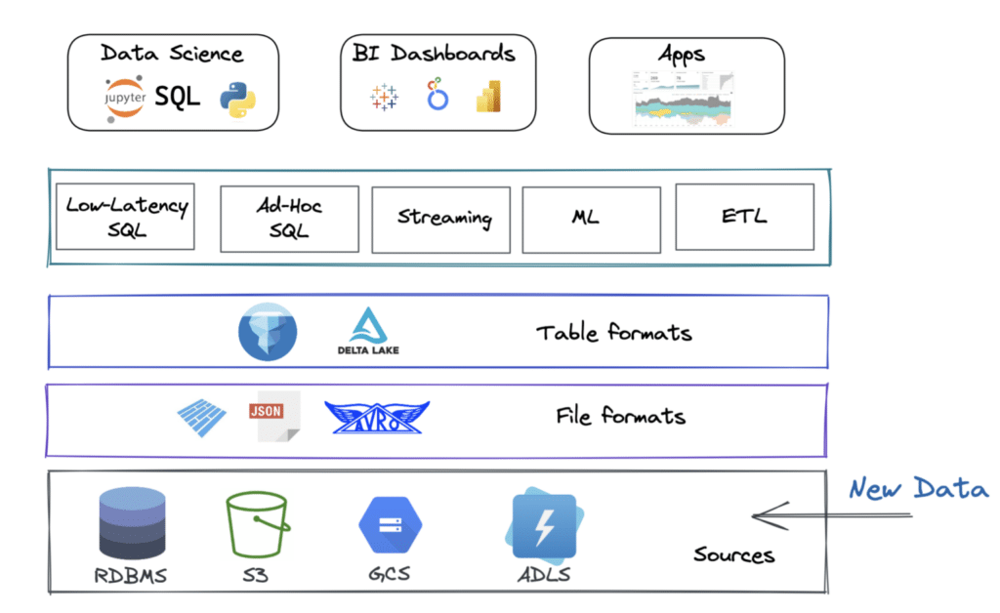


    Comparison of the number of parameters of models. Just look at how big GPT-3 is. And nobody knows about GPT-4…


    LLMs capabilities


* Creating a local large language model (LLM) is a significant undertaking.
* It requires substantial computational resources and expertise in machine learning. 
* It was not feasible to run local LLMs on your own local system because of the computational costs involved. 
* However, with the advent of new software, GPT4All and LM-Studio can be used to create complete software packages that work locally. 
* But let’s start with a HuggingFace Transformers source code example that shows you how to use the HuggingFace Libraries and PyTorch for LLMs (cloud-based, not local in this case):


## **Consider the HuggingFace Transformers Example**


* This is a complete program that uses the GPT-2 model, GPT-2 tokenizer, and is fine-tuned on the AG NEWS dataset (a small dataset used for utility purposes) is given below and explained in code snippets. 
* We can leverage the power of pre-trained models and fine-tune them on specific tasks.
* Importing necessary libraries and modules: 
    * The script starts by importing the necessary libraries and modules. AG_NEWS is a news classification dataset from the “torchtext.datasets” package. AutoModelWithLMHead and AdamW are imported from the transformers library. 
    * AutoModelWithLMHead is a class that provides automatic access to pre-trained models with a language modeling head, and AdamW is a class that implements the AdamW optimizer, a variant of the Adam optimizer with weight decay.

    ```


##     from torchtext.datasets import AG_NEWS


##     from transformers import AutoModelWithLMHead, AdamW


##     from transformers import AutoTokenizer
    ```


    * **Setting up the tokenizer:** The script uses the AutoTokenizer class from the transformers library to load the tokenizer associated with the “gpt2” model. The tokenizer is responsible for converting input text into a format that the model can understand. This includes splitting the text into tokens (words, subwords, or characters), mapping the tokens to their corresponding IDs in the model’s vocabulary, and creating the necessary inputs for the model (like attention masks).
    * tokenizer = AutoTokenizer.from_pretrained("gpt2")
    * **Setting the number of epochs:** The script sets the number of epochs for training to 50. An epoch is one complete pass through the entire training dataset. The number of epochs is a hyperparameter that you can tune. Training for more epochs can lead to better results, but it also increases the risk of overfitting and requires more computational resources.

    ```


##     EPOCHS = 50
    ```


    * **Preprocessing the data: **The preprocess_data function is defined to preprocess the data. It takes an iterator over the data and encodes the text in each item using the tokenizer. The AG_NEWS dataset is then loaded and preprocessed. The dataset is split into ‘train’ and the text from each item is encoded. Encoding the text involves splitting it into tokens, mapping the tokens to their IDs in the model’s vocabulary, and creating the necessary inputs for the model.

    ```


##     def preprocess_data(data_iter):


##        data = [tokenizer.encode(text) for _, text in data_iter]


##        return data


##     train_iter = AG_NEWS(split='train')


##     train_data = preprocess_data(train_iter)
    ```


* **Setting up the model and optimizer:** 
    * The script loads the pre-trained “gpt2” model using the AutoModelWithLMHead class and sets up the AdamW optimizer with the model’s parameters. The model is a transformer-based model with a language modeling head, which means it’s designed to generate text. The AdamW optimizer is a variant of the Adam optimizer with weight decay, which can help prevent overfitting.

    ```


##     model = AutoModelWithLMHead.from_pretrained("gpt2")


##     optimizer = AdamW(model.parameters())


##     model.train()


##     for epoch in range(EPOCHS):


##        for batch in train_data:


##            outputs = model(batch)


##            loss = outputs.loss


##            loss.backward()


##            optimizer.step()


##            optimizer.zero_grad()
    ```


* **Training the model:** The script trains the model for the specified number of epochs. In each epoch, it iterates over the batches of training data, feeds each batch to the model, computes the loss, performs backpropagation with loss.backward(), and updates the model’s parameters with optimizer.step(). It also resets the gradients with optimizer.zero_grad(). This is a standard training loop for PyTorch models.
* **Generating text:** After training, the script uses the model to generate text. It starts by encoding a prompt using the tokenizer, then feeds this encoded prompt to the model’s generate method. The output of the generate() method is a sequence of token IDs, which is then decoded back into text using the tokenizer.

    ```


##     prompt = tokenizer.encode("Write a summary of the new features in the latest release of the Julia Programming Language", return_tensors="pt")


##     generated = model.generate(prompt)


##     generated_text = tokenizer.decode(generated[0])
    ```


* **Saving the generated text: **Finally, the script saves the generated text to a file named “generated.txt”. This is done using Python’s built-in file handling functions.

    ```


##     with open("generated.txt", "w") as f:


##        f.write(generated_text)
    ```


* This script is a good example of how to fine-tune a pre-trained language model on a specific task. 
* Fine-tuning a large model like GPT-2 can be computationally intensive and may require a powerful machine or cloud-based resources. 
* _This script doesn’t include some important steps like splitting the data into training and validation sets, shuffling the data, and batching the data._ _These steps are crucial for training a robust model. _
* The entire program is given below:

    ```


##     from torchtext.datasets import AG_NEWS
##     from transformers import AutoModelWithLMHead, AdamW
##     from transformers import AutoTokenizer
##     tokenizer = AutoTokenizer.from_pretrained("gpt2")
##     EPOCHS = 50
##     def preprocess_data(data_iter):
##        data = [tokenizer.encode(text) for _, text in data_iter]
##        return data
##     train_iter = AG_NEWS(split='train')
##     train_data = preprocess_data(train_iter)
##     model = AutoModelWithLMHead.from_pretrained("gpt2")
##     optimizer = AdamW(model.parameters())
##     model.train()
##     for epoch in range(EPOCHS):
##        for batch in train_data:
##            outputs = model(batch)
##            loss = outputs.loss
##            loss.backward()
##            optimizer.step()
##            optimizer.zero_grad()
##     prompt = tokenizer.encode("Write a summary of the new features in the latest release of the Julia Programming Language", return_tensors="pt")
##     generated = model.generate(prompt)
##     generated_text = tokenizer.decode(generated[0])
##     with open("generated.txt", "w") as f:
##        f.write(generated_text)

    ```


## There are two packaged solutions for Local LLMs (and many more popping up, everyday). Two of them are the best. One is LM-Studio. The other is [https://gpt4all.io/index.html](https://gpt4all.io/index.html)


* _This is the best for those if you want a completely open-source on-premises system. But you need to have at least 32 GB of local RAM, 16 GB GPU RAM, a 3+ Ghz multicore(the more, the better) processor, and a local SSD.  LLMs are computationally, extremely expensive!_
* There’s a lot more to LLM models than just chat
* Given the expensive;y daunting computational requirements for fine-tuning musical and pictures and audio for LLMs we are not going to run them. 
* Some popular, already built and ready-to-go solutions as well as some interesting source material are:


## **Audio LLMs**


* [https://www.assemblyai.com/docs/guides/processing-audio-with-llms-using-lemur](https://www.assemblyai.com/docs/guides/processing-audio-with-llms-using-lemur)
* AudioGPT Research Paper — [https://arxiv.org/abs/2304.12995](https://arxiv.org/abs/2304.12995)
* Tango [https://tango-web.github.io/](https://tango-web.github.io/)
* [https://blog.google/technology/ai/musiclm-google-ai-test-kitchen/](https://blog.google/technology/ai/musiclm-google-ai-test-kitchen/)


## **Image LLMs**


* [https://www.linkedin.com/pulse/generating-images-large-language-model-gill-arun-krishnan](https://www.linkedin.com/pulse/generating-images-large-language-model-gill-arun-krishnan)
* **Stable Diffusion**
* **DALL E-1,2,3**
* **MidJourney**
* Bing Image Creator


## **Multimodal LLMs**


* [https://arxiv.org/abs/2306.09093](https://arxiv.org/abs/2306.09093) Macaw-LLM research paper. 
* [https://github.com/BradyFU/Awesome-Multimodal-Large-Language-Models](https://github.com/BradyFU/Awesome-Multimodal-Large-Language-Models)
* [https://openai.com/research/gpt-4](https://openai.com/research/gpt-4) 


## **General LLM Resources**


* [https://beebom.com/best-large-language-models-llms/](https://beebom.com/best-large-language-models-llms/)
* [https://roadmap.sh/guides/free-resources-to-learn-llms](https://roadmap.sh/guides/free-resources-to-learn-llms)
* [https://github.com/Hannibal046/Awesome-LLM](https://github.com/Hannibal046/Awesome-LLM)
* [https://medium.com/@abonia/best-llm-and-llmops-resources-for-2023-75e96ac37feb](https://medium.com/@abonia/best-llm-and-llmops-resources-for-2023-75e96ac37feb)
* [https://learn.deeplearning.ai/](https://learn.deeplearning.ai/) 

## 
    **Fine-Tuning Your LLM - A Revisit**

* Again. fine-tuning is the process of continuing the training of a pre-trained LLM on a specific dataset. 
* You might ask why we need to train the model further if we can already add data using RAG. 
* The simple answer is that only fine-tuning can tailor your model to understand a specific domain or define its “style”. 

    :


    Classical approach of fine-tuning on domain specific data (all icons from [flaticon](http://flaticon.com/))

1. Take a trained LLM, sometimes called Base LLM. You can download them from [HuggingFace](https://huggingface.co/spaces/HuggingFaceH4/open_llm_leaderboard).
2. Prepare your training data. You only need to compile instructions and responses. [Here’s an example](https://huggingface.co/datasets/databricks/databricks-dolly-15k) of such a dataset. You can also [generate synthetic data](https://www.promptingguide.ai/applications/generating) using GPT-4.
3. Choose a suitable fine-tuning method. [LoRA](https://github.com/microsoft/LoRA) and [QLoRA](https://github.com/artidoro/qlora) are currently popular.
4. Fine-tune the model on new data.

### 
    **When to Use**

* **Niche Applications:** When the application deals with specialized or unconventional topics. For example, legal document applications that need to understand and handle legal jargon.
* **Custom Language Styles:** For applications requiring a specific tone or style. For example, creating an [AI character](https://beta.character.ai/) whether it’s a celebrity or a character from a book.

### 
    **When NOT to Use**

* **Broad Applications:** Where the scope of the application is general and doesn’t require specialized knowledge.
* **Limited Data:** Fine-tuning requires a significant amount of relevant data. However, you can always [generate them with another LLM](https://www.confident-ai.com/blog/how-to-generate-synthetic-data-using-llms-part-1). For example, the [Alpaca dataset](https://github.com/gururise/AlpacaDataCleaned) of 52k LLM-generated instruction-response pairs was used to create the first finetuning [Llama v1](https://arxiv.org/abs/2302.13971) model earlier this year.

### 
    **Fine-tuning LLM**


    Let us look at a high-level library, [Lit-GPT](https://github.com/Lightning-AI/lit-gpt), which hides all complexities, hence doesn’t allow for much customization of the training process, but one can quickly conduct experiments and get initial results. 


    You’ll need just a few lines of code:


    ```
    # 1. Download the model:
    python scripts/download.py --repo_id meta-llama/Llama-2-7b

    # 2. Convert the checkpoint to the lit-gpt format:
    python scripts/convert_hf_checkpoint.py --checkpoint_dir checkpoints/llama

    # 3. Generate an instruction tuning dataset:
    python scripts/prepare_alpaca.py  # it should be your dataset

    # 4. Run the finetuning script
    python finetune/lora.py \
       --checkpoint_dir checkpoints/llama/
       --data_dir your_data_folder/
       --out_dir my_finetuned_model/
    ```


    And that’s it! Your training process will start:


    


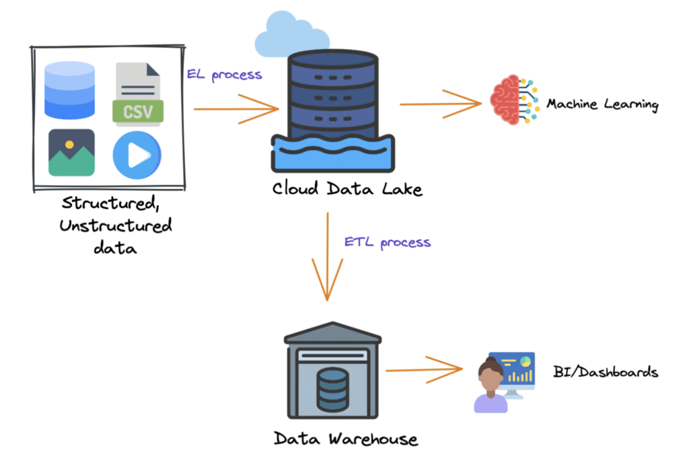


    _This  takes approximately **10 hours** and **30 GB** memory to fine-tune Falcon-7B on a single A100 GPU._

* The fine-tuning process is quite complex and to get better results, you’ll need to understand various adapters, their parameters, and much more. 
* However, even after such a simple iteration, you will have a new model that follows your instructions.

### 
    **Some References to chase down:**

* [Create a Clone of Yourself With a Fine-tuned LLM](https://medium.com/better-programming/unleash-your-digital-twin-how-fine-tuning-llm-can-create-your-perfect-doppelganger-b5913e7dda2e) — an article about collecting datasets, using parameters, and  useful tips on fine-tuning.
* [Understanding Parameter-Efficient Fine-tuning of Large Language Models](https://lightning.ai/pages/community/article/understanding-llama-adapters/) — an excellent tutorial to get into the details of the concept of fine-tuning and popular parameter-efficient alternatives.
* [Fine-tuning LLMs with LoRA and QLoRA: Insights from Hundreds of Experiments](https://lightning.ai/pages/community/lora-insights/) — one of my favorite articles for understanding the capabilities of LoRA.
* [OpenAI Fine-tuning](https://platform.openai.com/docs/guides/fine-tuning) — if you want to fine-tune GPT-3.5 with minimal effort.

## 
    **Deploying Your LLM Application in Production**


    


* There are a huge number of frameworks that specialize in deploying large language models with
* Lots of pre-built wrappers and integrations.
* A vast selection of available models.
* A multitude of internal optimizations.
* Rapid prototyping.

### 
    **Choosing the Right Framework**

* The choice of framework for deploying an LLM application depends on various factors, including the size of the model, the scalability requirements of the application, and the deployment environment. 
* Heres a  cheat sheet:

        


    You can get a more detailed overview of the existing solutions here [7 Frameworks for Serving LLMs](https://medium.com/better-programming/frameworks-for-serving-llms-60b7f7b23407)  


        Comparison of frameworks for LLMs inference


### 
    **Example Code for Deployment**

* Let’s move from theory to practice and try to deploy LLaMA-2 using [Text Generation Inference](https://github.com/huggingface/text-generation-inference). 
* And, as you might have guessed, you’ll need just a few lines of code:

    ```
    # 1. Create a folder where your model will be stored:
    mkdir data

    # 2. Run Docker container (launch RestAPI service):
    docker run --gpus all --shm-size 1g -p 8080:80 \
       -v $volume:/data \
       ghcr.io/huggingface/text-generation-inference:1.1.0
       --model-id meta-llama/Llama-2-7b

    # 3. And now you can make requests:
    curl 127.0.0.1:8080/generate \
       -X POST \
       -d '{"inputs":"Tell me a joke!","parameters":{"max_new_tokens":20}}' \
       -H 'Content-Type: application/json'
    ```


    - That’s it! You’ve set up a RestAPI service with built-in logging, Prometheus endpoint for monitoring, token streaming, and your model is fully optimized. 


    API Documentation


### 
    **References:**

* [7 Frameworks for Serving LLMs ](https://medium.com/better-programming/frameworks-for-serving-llms-60b7f7b23407)— comprehensive guide into LLMs inference and serving with detailed comparison.
* [Inference Endpoints](https://huggingface.co/inference-endpoints) — a product from HuggingFace that will allow you to deploy any LLMs in a few clicks. A good choice when you need rapid prototyping.

## 
    **To get in a little deeper**

* We’ve covered the basic concepts needed for developing LLM-based applications, there are still some aspects you’ll likely encounter in the future. Here are  a few useful reference:

### 
    **Optimization**

* When you launch your first model, you inevitably find it’s not as fast as you’d like and consumes a lot of resources and you’ll need to understand how it can be optimized.
* [7 Ways To Speed Up Inference of Your Hosted LLMs](https://medium.com/better-programming/speed-up-llm-inference-83653aa24c47) — techniques to speed up inference of LLMs to increase token generation speed and reduce memory consumption.
* [Optimizing Memory Usage for Training LLMs in PyTorch](https://lightning.ai/pages/community/tutorial/pytorch-memory-vit-llm/) — article provides a series of techniques that can reduce memory consumption in PyTorch by approximately 20x without sacrificing modeling performance and prediction accuracy.

### 
    **Evaluating**

* Suppose you have a fine-tuned model you need to be sure that its quality has improved.  What metrics should we use to check quality?
* [All about evaluating Large language models](https://explodinggradients.com/all-about-evaluating-large-language-models) — a good overview article about benchmarks and metrics.
* [evals](https://github.com/openai/evals) — the most popular framework for evaluating LLMs and LLM systems.

### 
    **Vector Databases**

* If you work with RAG, at some point, you’ll move from storing vectors in memory to a database. 
* For this, it’s important to understand what’s currently on the market and its limitations.
* [All You Need to Know about Vector Databases](https://towardsdatascience.com/all-you-need-to-know-about-vector-databases-and-how-to-use-them-to-augment-your-llm-apps-596f39adfedb) — a step-by-step guide by  \
[Dominik Polzer \
](https://medium.com/u/3ab8d3143e32?source=post_page-----5c45708156bc--------------------------------) to discover and harness the power of vector databases.
* [Picking a vector database: a comparison and guide for 2023](https://benchmark.vectorview.ai/vectordbs.html) — comparison of Pinecone, Weviate, Milvus, Qdrant, Chroma, Elasticsearch and PGvector databases.

### 
    **LLM Agents**

* One of  the most promising developments in LLMs are LLM Agents i f you want multiple models to work together. 
* The following links are worth going through
* [A Survey on LLM-based Autonomous Agents](https://github.com/paitesanshi/llm-agent-survey#-more-comprehensive-summarization) — this is probably the most comprehensive overview of LLM based agents.
* [autogen](https://github.com/microsoft/autogen) — is a framework that enables the development of LLM applications using multiple agents that can converse with each other to solve tasks.
* [OpenAgents ](https://github.com/xlang-ai/OpenAgents)— an open platform for using and hosting language agents in the wild.

### 
    **Reinforcement Learning from Human Feedback (RLHF)**

* As soon as you allow users access to your model, you start taking responsibility. 
* What if it responds rudely? Or reveals bomb-making ingredients? To avoid this, check out these articles:
* [Illustrating Reinforcement Learning from Human Feedback (RLHF)](https://huggingface.co/blog/rlhf) — an overview article that details the RLHF technology.
* [RL4LMs](https://github.com/allenai/RL4LMs) — a modular RL library to fine-tune language models to human preferences.
* [TRL ](https://github.com/huggingface/trl)— a set of tools to train transformer language models with Reinforcement Learning, from the Supervised Fine-tuning step (SFT), Reward Modeling step (RM) to the Proximal Policy Optimization (PPO) step.

**Summary:**


* The material covered today is broad but is the technology of the future. 
* Junior Programmers, Artists, ML Engineers, Data Processing Analysts, Beginner Data Scientists, and practically every other digital job should be learning this technology. There is a lot of scope and opportunity. 
* Generative AI is the future of the Digital Media World. Artists are feeling the impact today. A similar situation is looming for junior-level software engineers. 
* But the solution is simple: Skill up! Help someone else Skill up! Regain Control!